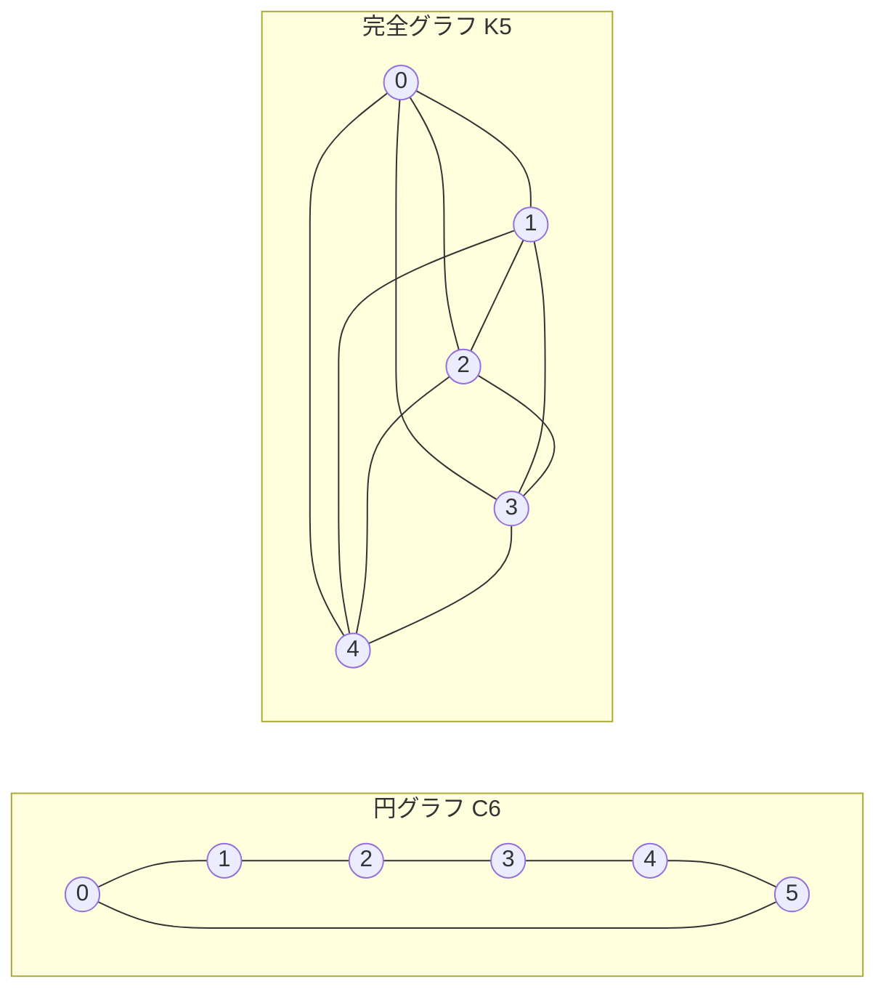

---
navigation:
  order: 20
---

# 2. 準備

## 2.1 可逆性とスペクトル

**定義 2.1（可逆性）.** 遷移行列 \(P\) が分布 \(\pi\) に関して可逆であるとは、すべての \(x, y\) について \(\pi(x) P(x,y) = \pi(y) P(y,x)\) が成り立つことをいう。

グラフ上のランダムウォークは \(\pi(x) P(x,y) = \frac{1}{4|E|}\)（辺があるとき）により可逆である。可逆な \(P\) は内積 \(\langle f, g \rangle_\pi = \sum_x f(x) g(x) \pi(x)\) に関して自己随伴であり、実固有値

$$
1 = \lambda_1 > \lambda_2 \ge \cdots \ge \lambda_n \ge -1
$$

を持つ。遅延ウォークでは \(P = \frac12 (I + Q)\)（\(Q\) は単純ウォーク）なので、すべての固有値は \(0\) 以上である。

**定義 2.2（スペクトルギャップ）.** \(\gamma = 1 - \lambda_2\) をスペクトルギャップ、\(t_{\mathrm{rel}} = 1/\gamma\) を緩和時間という。

## 2.2 補題

**補題 2.3.** 可逆な \(P\) と任意の \(x\) について

$$
\bigl\| P^t(x,\cdot) - \pi \bigr\|_{\mathrm{TV}} \le \frac{1}{2} \sqrt{\frac{1 - \pi(x)}{\pi(x)}}\; \lambda_\ast^{\,t}, \qquad \lambda_\ast = \max_{i \ge 2} |\lambda_i|.
$$

*証明.* Cauchy–Schwarz により全変動距離を \(\ell^2(\pi)\) ノルムで抑え、\(P^t\) の固有展開で \(\lambda_1 = 1\) の項を除いた残りを評価する。詳細は [1, 定理 12.3] を参照。 \(\square\)

## 2.3 例に用いるグラフ

**図 1.** 円グラフ \(C_6\)（左）と完全グラフ \(K_5\)（右）。円グラフは直径が大きく混合が遅い。完全グラフは 1 歩で一様に近づく。
