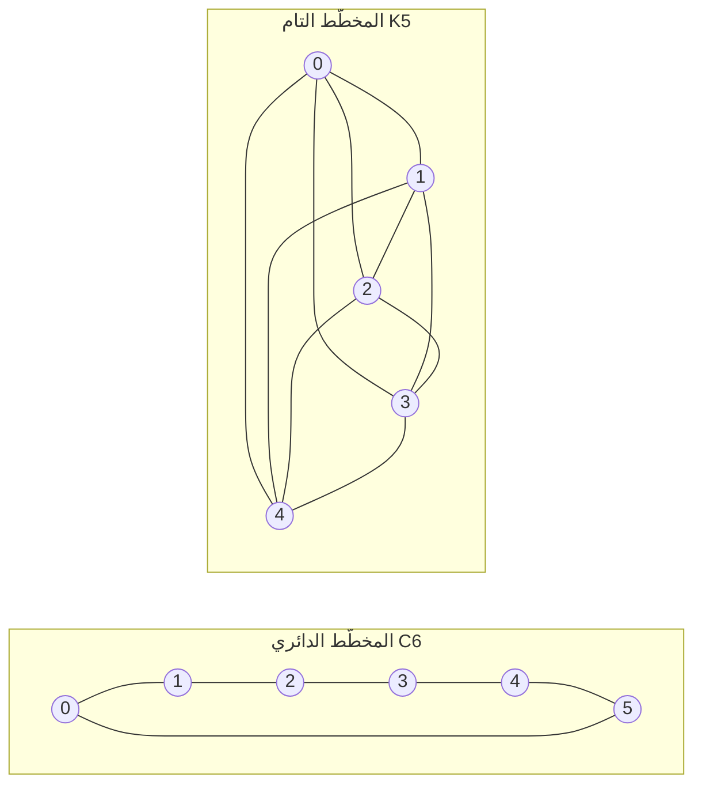

---
navigation:
  order: 20
---

# 2. التمهيد

## 2.1 الانعكاسية والطيف

**تعريف 2.1 (الانعكاسية).** يقال إن مصفوفة الانتقال \(P\) انعكاسية بالنسبة إلى التوزيع \(\pi\) إذا تحقق \(\pi(x) P(x,y) = \pi(y) P(y,x)\) لكل \(x, y\).

المشي العشوائي على مخطَّط انعكاسي، لأن \(\pi(x) P(x,y) = \frac{1}{4|E|}\) عند وجود حرف يصل بين الرأسين. والمصفوفة الانعكاسية \(P\) ذاتية الإلحاق بالنسبة إلى الجداء الداخلي \(\langle f, g \rangle_\pi = \sum_x f(x) g(x) \pi(x)\)، ولها قيم ذاتية حقيقية

$$
1 = \lambda_1 > \lambda_2 \ge \cdots \ge \lambda_n \ge -1
$$

وفي المشي الكسول يكون \(P = \frac12 (I + Q)\) حيث \(Q\) هو المشي البسيط، ولذلك تكون كل القيم الذاتية أكبر من \(0\) أو تساويه.

**تعريف 2.2 (الفجوة الطيفية).** يسمى \(\gamma = 1 - \lambda_2\) الفجوة الطيفية، ويسمى \(t_{\mathrm{rel}} = 1/\gamma\) زمن الاسترخاء.

## 2.2 مبرهنة مساعدة

**المبرهنة المساعدة 2.3.** لكل مصفوفة انعكاسية \(P\) ولكل \(x\)،

$$
\bigl\| P^t(x,\cdot) - \pi \bigr\|_{\mathrm{TV}} \le \frac{1}{2} \sqrt{\frac{1 - \pi(x)}{\pi(x)}}\; \lambda_\ast^{\,t}, \qquad \lambda_\ast = \max_{i \ge 2} |\lambda_i|.
$$

*البرهان.* تحدّ متباينة Cauchy–Schwarz مسافة التغاير الكلي بمعيار \(\ell^2(\pi)\)، ثم يقدَّر ما يتبقى من النشر الذاتي للمصفوفة \(P^t\) بعد حذف الحد \(\lambda_1 = 1\). للتفاصيل انظر [1، المبرهنة 12.3]. \(\square\)

## 2.3 المخطَّطات المستعملة في الأمثلة

**الشكل 1.** المخطَّط الدائري \(C_6\) (إلى اليسار) والمخطَّط التام \(K_5\) (إلى اليمين). للمخطَّط الدائري قطر كبير ومزجه بطيء، أما المخطَّط التام فيقترب من التوزيع المنتظم بخطوة واحدة.
