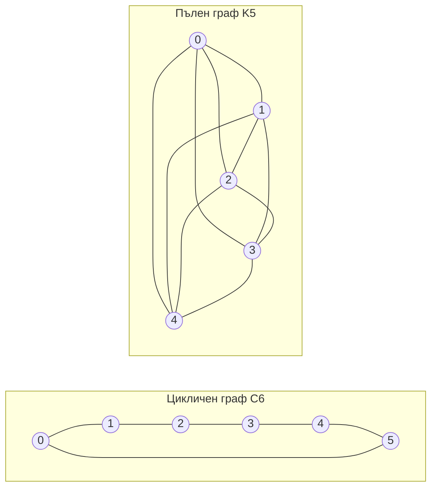

---
navigation:
  order: 20
---

# 2. Предварителни сведения

## 2.1 Обратимост и спектър

**Определение 2.1 (обратимост).** Преходна матрица \(P\) е обратима относно разпределение \(\pi\), ако за всички \(x, y\) е изпълнено \(\pi(x) P(x,y) = \pi(y) P(y,x)\).

Случайното блуждаене върху граф е обратимо, тъй като \(\pi(x) P(x,y) = \frac{1}{4|E|}\) (когато има ребро). Обратима матрица \(P\) е самоспрегната относно скаларното произведение \(\langle f, g \rangle_\pi = \sum_x f(x) g(x) \pi(x)\) и има реални собствени стойности

$$
1 = \lambda_1 > \lambda_2 \ge \cdots \ge \lambda_n \ge -1
$$

При мързеливото блуждаене \(P = \frac12 (I + Q)\) (където \(Q\) е простото блуждаене), така че всички собствени стойности са не по-малки от \(0\).

**Определение 2.2 (спектрална пролука).** \(\gamma = 1 - \lambda_2\) се нарича спектрална пролука, а \(t_{\mathrm{rel}} = 1/\gamma\) — време на релаксация.

## 2.2 Лема

**Лема 2.3.** За обратима матрица \(P\) и произволно \(x\)

$$
\bigl\| P^t(x,\cdot) - \pi \bigr\|_{\mathrm{TV}} \le \frac{1}{2} \sqrt{\frac{1 - \pi(x)}{\pi(x)}}\; \lambda_\ast^{\,t}, \qquad \lambda_\ast = \max_{i \ge 2} |\lambda_i|.
$$

*Доказателство.* По неравенството на Коши–Шварц разстоянието по пълна вариация се оценява чрез нормата в \(\ell^2(\pi)\), след което се оценява собственото разлагане на \(P^t\) без члена с \(\lambda_1 = 1\). За подробности вижте [1, теорема 12.3]. \(\square\)

## 2.3 Графите, използвани в примерите

**Фигура 1.** Цикличният граф \(C_6\) (вляво) и пълният граф \(K_5\) (вдясно). Цикличният граф има голям диаметър и се смесва бавно. Пълният граф се доближава до равномерното разпределение за една стъпка.
