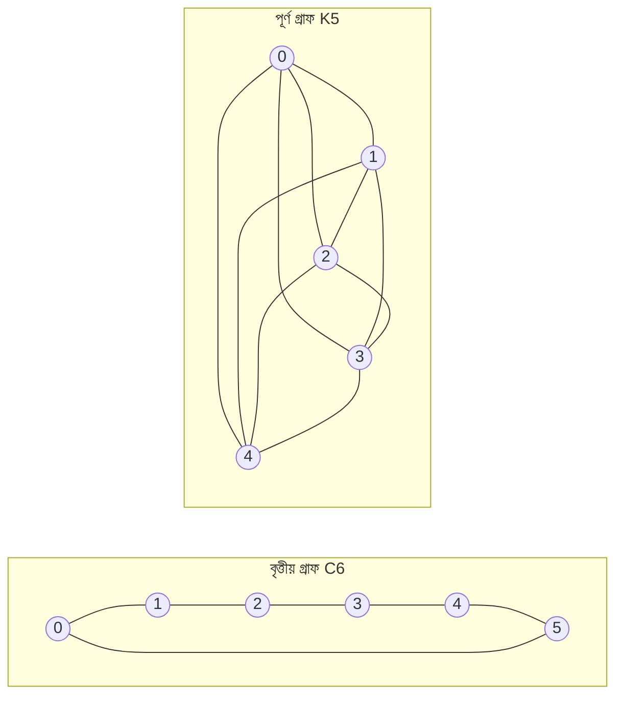

---
navigation:
  order: 20
---

# ২. প্রস্তুতি

## ২.১ প্রত্যাবর্তনযোগ্যতা ও বর্ণালি

**সংজ্ঞা ২.১ (প্রত্যাবর্তনযোগ্যতা).** কোনো ট্রানজিশন ম্যাট্রিক্স \(P\) কে বণ্টন \(\pi\) সাপেক্ষে প্রত্যাবর্তনযোগ্য বলা হয় যদি সব \(x, y\)-এর জন্য \(\pi(x) P(x,y) = \pi(y) P(y,x)\) সত্য হয়।

গ্রাফের উপর র‍্যান্ডম ওয়াক প্রত্যাবর্তনযোগ্য, কারণ প্রান্ত থাকলে \(\pi(x) P(x,y) = \frac{1}{4|E|}\) হয়। প্রত্যাবর্তনযোগ্য \(P\) অন্তঃগুণন \(\langle f, g \rangle_\pi = \sum_x f(x) g(x) \pi(x)\) সাপেক্ষে স্ব-সংসক্ত এবং এর বাস্তব আইগেনমান

$$
1 = \lambda_1 > \lambda_2 \ge \cdots \ge \lambda_n \ge -1
$$

রয়েছে। বিলম্বিত ওয়াকে \(P = \frac12 (I + Q)\)（\(Q\) হলো সরল ওয়াক）হওয়ায় সব আইগেনমান \(0\) বা তার বেশি।

**সংজ্ঞা ২.২ (বর্ণালি ব্যবধান).** \(\gamma = 1 - \lambda_2\) কে বর্ণালি ব্যবধান এবং \(t_{\mathrm{rel}} = 1/\gamma\) কে শিথিলন সময় বলা হয়।

## ২.২ উপপাদ্যিকা

**উপপাদ্যিকা ২.৩.** প্রত্যাবর্তনযোগ্য \(P\) এবং যেকোনো \(x\)-এর জন্য

$$
\bigl\| P^t(x,\cdot) - \pi \bigr\|_{\mathrm{TV}} \le \frac{1}{2} \sqrt{\frac{1 - \pi(x)}{\pi(x)}}\; \lambda_\ast^{\,t}, \qquad \lambda_\ast = \max_{i \ge 2} |\lambda_i|.
$$

*প্রমাণ.* Cauchy–Schwarz দ্বারা সম্পূর্ণ প্রকরণ দূরত্বকে \(\ell^2(\pi)\) নর্ম দিয়ে সীমাবদ্ধ করা হয়, এবং \(P^t\)-এর আইগেন বিস্তারে \(\lambda_1 = 1\) পদটি বাদ দিয়ে অবশিষ্টাংশ নিরূপণ করা হয়। বিস্তারিত জানতে [1, উপপাদ্য 12.3] দেখুন। \(\square\)

## ২.৩ উদাহরণে ব্যবহৃত গ্রাফ

**চিত্র ১.** বৃত্তীয় গ্রাফ \(C_6\)（বাঁ দিকে）এবং পূর্ণ গ্রাফ \(K_5\)（ডান দিকে）। বৃত্তীয় গ্রাফের ব্যাস বড় এবং মিশ্রণ ধীর। পূর্ণ গ্রাফ এক ধাপেই সুষমের কাছাকাছি পৌঁছায়।
