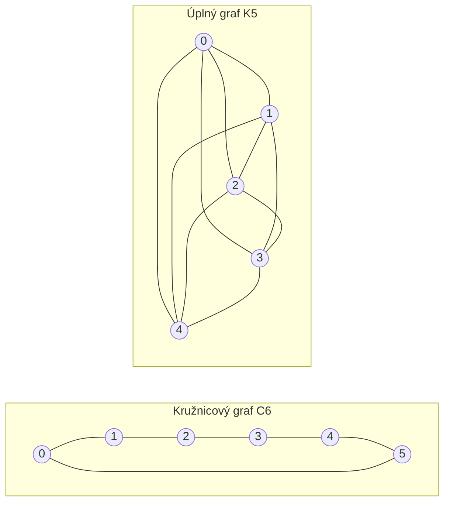

---
navigation:
  order: 20
---

# 2. Přípravné pojmy

## 2.1 Vratnost a spektrum

**Definice 2.1 (Vratnost).** Přechodová matice \(P\) je vratná vzhledem k rozdělení \(\pi\), pokud pro všechna \(x, y\) platí \(\pi(x) P(x,y) = \pi(y) P(y,x)\).

Náhodná procházka na grafu je vratná, neboť \(\pi(x) P(x,y) = \frac{1}{4|E|}\) (je-li přítomna hrana). Vratná matice \(P\) je samoadjungovaná vzhledem ke skalárnímu součinu \(\langle f, g \rangle_\pi = \sum_x f(x) g(x) \pi(x)\) a má reálná vlastní čísla

$$
1 = \lambda_1 > \lambda_2 \ge \cdots \ge \lambda_n \ge -1
$$

U líné procházky je \(P = \frac12 (I + Q)\) (kde \(Q\) je jednoduchá procházka), takže všechna vlastní čísla jsou nezáporná.

**Definice 2.2 (Spektrální mezera).** Veličina \(\gamma = 1 - \lambda_2\) se nazývá spektrální mezera a \(t_{\mathrm{rel}} = 1/\gamma\) relaxační čas.

## 2.2 Lemma

**Lemma 2.3.** Pro vratnou matici \(P\) a libovolné \(x\) platí

$$
\bigl\| P^t(x,\cdot) - \pi \bigr\|_{\mathrm{TV}} \le \frac{1}{2} \sqrt{\frac{1 - \pi(x)}{\pi(x)}}\; \lambda_\ast^{\,t}, \qquad \lambda_\ast = \max_{i \ge 2} |\lambda_i|.
$$

*Důkaz.* Cauchyho–Schwarzova nerovnost omezí vzdálenost v totální variaci normou \(\ell^2(\pi)\) a vlastní rozvoj matice \(P^t\) se vyhodnotí po odstranění členu s \(\lambda_1 = 1\). Podrobnosti viz [1, věta 12.3]. \(\square\)

## 2.3 Grafy použité v příkladech

**Obrázek 1.** Kružnicový graf \(C_6\) (vlevo) a úplný graf \(K_5\) (vpravo). Kružnicový graf má velký průměr a míchá se pomalu. Úplný graf se blíží rovnoměrnému rozdělení po jediném kroku.
