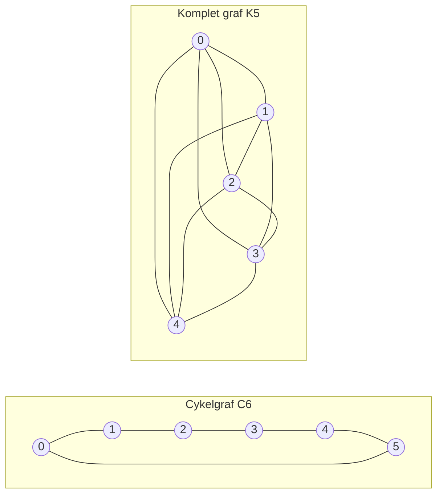

---
navigation:
  order: 20
---

# 2. Forberedelser

## 2.1 Reversibilitet og spektrum

**Definition 2.1 (Reversibilitet).** En overgangsmatrix \(P\) kaldes reversibel med hensyn til en fordeling \(\pi\), hvis \(\pi(x) P(x,y) = \pi(y) P(y,x)\) gælder for alle \(x, y\).

Tilfældig vandring på en graf er reversibel, da \(\pi(x) P(x,y) = \frac{1}{4|E|}\) (når der findes en kant). Et reversibelt \(P\) er selvadjungeret med hensyn til det indre produkt \(\langle f, g \rangle_\pi = \sum_x f(x) g(x) \pi(x)\) og har de reelle egenværdier

$$
1 = \lambda_1 > \lambda_2 \ge \cdots \ge \lambda_n \ge -1
$$

For den dovne vandring er \(P = \frac12 (I + Q)\) (hvor \(Q\) er den simple vandring), så alle egenværdier er mindst \(0\).

**Definition 2.2 (Spektralgab).** \(\gamma = 1 - \lambda_2\) kaldes spektralgabet, og \(t_{\mathrm{rel}} = 1/\gamma\) kaldes relaksationstiden.

## 2.2 Lemma

**Lemma 2.3.** For et reversibelt \(P\) og et vilkårligt \(x\) gælder

$$
\bigl\| P^t(x,\cdot) - \pi \bigr\|_{\mathrm{TV}} \le \frac{1}{2} \sqrt{\frac{1 - \pi(x)}{\pi(x)}}\; \lambda_\ast^{\,t}, \qquad \lambda_\ast = \max_{i \ge 2} |\lambda_i|.
$$

*Bevis.* Ved Cauchy–Schwarz begrænses totalvariationsafstanden af \(\ell^2(\pi)\)-normen, og egenudviklingen af \(P^t\) vurderes, efter at leddet med \(\lambda_1 = 1\) er fjernet. Se [1, Sætning 12.3] for detaljerne. \(\square\)

## 2.3 Grafer anvendt i eksemplerne

**Figur 1.** Cykelgrafen \(C_6\) (til venstre) og den komplette graf \(K_5\) (til højre). Cykelgrafen har stor diameter og blander langsomt. Den komplette graf nærmer sig den uniforme fordeling på ét skridt.
