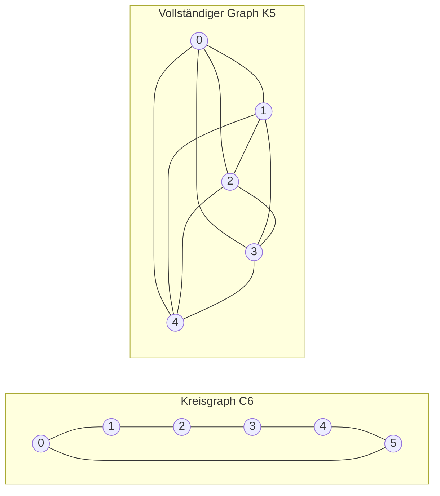

---
navigation:
  order: 20
---

# 2. Vorbereitungen

## 2.1 Reversibilität und Spektrum

**Definition 2.1 (Reversibilität).** Eine Übergangsmatrix \(P\) heißt reversibel bezüglich einer Verteilung \(\pi\), wenn für alle \(x, y\) gilt: \(\pi(x) P(x,y) = \pi(y) P(y,x)\).

Die Irrfahrt auf einem Graphen ist reversibel, da \(\pi(x) P(x,y) = \frac{1}{4|E|}\) gilt, sofern eine Kante vorhanden ist. Ein reversibles \(P\) ist selbstadjungiert bezüglich des Skalarprodukts \(\langle f, g \rangle_\pi = \sum_x f(x) g(x) \pi(x)\) und besitzt reelle Eigenwerte

$$
1 = \lambda_1 > \lambda_2 \ge \cdots \ge \lambda_n \ge -1
$$

Bei der trägen Irrfahrt ist \(P = \frac12 (I + Q)\) (wobei \(Q\) die einfache Irrfahrt bezeichnet), sodass alle Eigenwerte mindestens \(0\) sind.

**Definition 2.2 (Spektrallücke).** \(\gamma = 1 - \lambda_2\) heißt Spektrallücke und \(t_{\mathrm{rel}} = 1/\gamma\) Relaxationszeit.

## 2.2 Lemma

**Lemma 2.3.** Für ein reversibles \(P\) und beliebiges \(x\) gilt

$$
\bigl\| P^t(x,\cdot) - \pi \bigr\|_{\mathrm{TV}} \le \frac{1}{2} \sqrt{\frac{1 - \pi(x)}{\pi(x)}}\; \lambda_\ast^{\,t}, \qquad \lambda_\ast = \max_{i \ge 2} |\lambda_i|.
$$

*Beweis.* Mit Cauchy–Schwarz wird der Totalvariationsabstand durch die \(\ell^2(\pi)\)-Norm abgeschätzt; anschließend wird die Eigenentwicklung von \(P^t\) ohne den Term \(\lambda_1 = 1\) ausgewertet. Einzelheiten siehe [1, Satz 12.3]. \(\square\)

## 2.3 Die in den Beispielen verwendeten Graphen

**Abbildung 1.** Der Kreisgraph \(C_6\) (links) und der vollständige Graph \(K_5\) (rechts). Der Kreisgraph hat einen großen Durchmesser und mischt langsam. Der vollständige Graph nähert sich bereits nach einem Schritt der Gleichverteilung.
