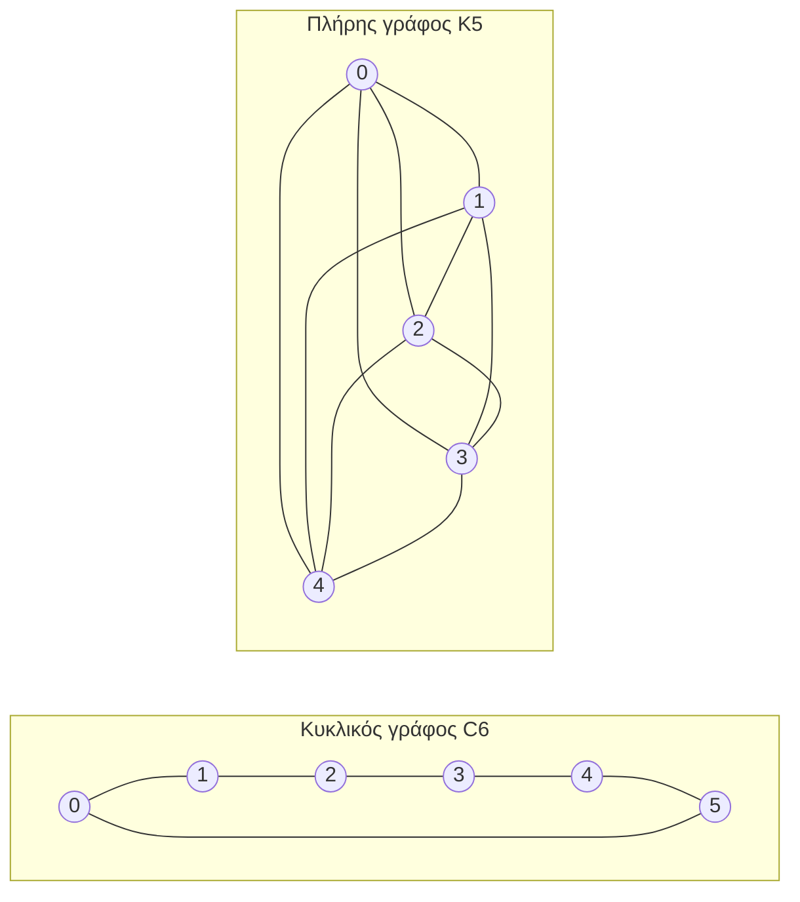

---
navigation:
  order: 20
---

# 2. Προκαταρκτικά

## 2.1 Αντιστρεψιμότητα και φάσμα

**Ορισμός 2.1 (Αντιστρεψιμότητα).** Ένας πίνακας μετάβασης \(P\) λέγεται αντιστρέψιμος ως προς μια κατανομή \(\pi\) όταν ισχύει \(\pi(x) P(x,y) = \pi(y) P(y,x)\) για όλα τα \(x, y\).

Ο τυχαίος περίπατος σε γράφο είναι αντιστρέψιμος, καθώς \(\pi(x) P(x,y) = \frac{1}{4|E|}\) (όταν υπάρχει ακμή). Ένας αντιστρέψιμος \(P\) είναι αυτοσυζυγής ως προς το εσωτερικό γινόμενο \(\langle f, g \rangle_\pi = \sum_x f(x) g(x) \pi(x)\) και έχει πραγματικές ιδιοτιμές

$$
1 = \lambda_1 > \lambda_2 \ge \cdots \ge \lambda_n \ge -1
$$

Στον νωθρό περίπατο ισχύει \(P = \frac12 (I + Q)\) (όπου \(Q\) ο απλός περίπατος), οπότε κάθε ιδιοτιμή είναι μεγαλύτερη ή ίση του \(0\).

**Ορισμός 2.2 (Φασματικό χάσμα).** Το \(\gamma = 1 - \lambda_2\) ονομάζεται φασματικό χάσμα και το \(t_{\mathrm{rel}} = 1/\gamma\) χρόνος χαλάρωσης.

## 2.2 Λήμμα

**Λήμμα 2.3.** Για αντιστρέψιμο \(P\) και οποιοδήποτε \(x\) ισχύει

$$
\bigl\| P^t(x,\cdot) - \pi \bigr\|_{\mathrm{TV}} \le \frac{1}{2} \sqrt{\frac{1 - \pi(x)}{\pi(x)}}\; \lambda_\ast^{\,t}, \qquad \lambda_\ast = \max_{i \ge 2} |\lambda_i|.
$$

*Απόδειξη.* Με την ανισότητα Cauchy–Schwarz η απόσταση ολικής μεταβολής φράσσεται από τη νόρμα \(\ell^2(\pi)\), και στο ιδιοανάπτυγμα του \(P^t\) εκτιμάται ό,τι απομένει μετά την αφαίρεση του όρου \(\lambda_1 = 1\). Για τις λεπτομέρειες βλ. [1, Θεώρημα 12.3]. \(\square\)

## 2.3 Οι γράφοι των παραδειγμάτων

**Σχήμα 1.** Ο κυκλικός γράφος \(C_6\) (αριστερά) και ο πλήρης γράφος \(K_5\) (δεξιά). Ο κυκλικός γράφος έχει μεγάλη διάμετρο και αναμειγνύεται αργά. Ο πλήρης γράφος πλησιάζει την ομοιόμορφη κατανομή σε ένα βήμα.
