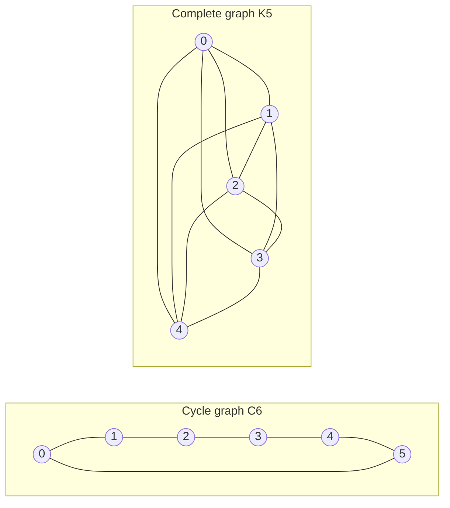

---
navigation:
  order: 20
---

# 2. Preliminaries

## 2.1 Reversibility and spectrum

**Definition 2.1 (Reversibility).** A transition matrix \(P\) is reversible with respect to a distribution \(\pi\) if \(\pi(x) P(x,y) = \pi(y) P(y,x)\) holds for all \(x, y\).

The random walk on a graph is reversible, since \(\pi(x) P(x,y) = \frac{1}{4|E|}\) whenever an edge joins \(x\) and \(y\). A reversible \(P\) is self-adjoint with respect to the inner product \(\langle f, g \rangle_\pi = \sum_x f(x) g(x) \pi(x)\), and has real eigenvalues

$$
1 = \lambda_1 > \lambda_2 \ge \cdots \ge \lambda_n \ge -1.
$$

For the lazy walk, \(P = \frac12 (I + Q)\) where \(Q\) is the simple walk, so every eigenvalue is at least \(0\).

**Definition 2.2 (Spectral gap).** \(\gamma = 1 - \lambda_2\) is the spectral gap, and \(t_{\mathrm{rel}} = 1/\gamma\) the relaxation time.

## 2.2 A lemma

**Lemma 2.3.** For a reversible \(P\) and any \(x\),

$$
\bigl\| P^t(x,\cdot) - \pi \bigr\|_{\mathrm{TV}} \le \frac{1}{2} \sqrt{\frac{1 - \pi(x)}{\pi(x)}}\; \lambda_\ast^{\,t}, \qquad \lambda_\ast = \max_{i \ge 2} |\lambda_i|.
$$

*Proof.* Cauchy–Schwarz bounds the total variation distance by the \(\ell^2(\pi)\) norm, and the eigen-expansion of \(P^t\) is evaluated after removing the \(\lambda_1 = 1\) term. See [1, Theorem 12.3] for the details. \(\square\)

## 2.3 The graphs used in the examples

**Figure 1.** The cycle graph \(C_6\) (left) and the complete graph \(K_5\) (right). The cycle graph has a large diameter and mixes slowly; the complete graph is close to uniform after a single step.
