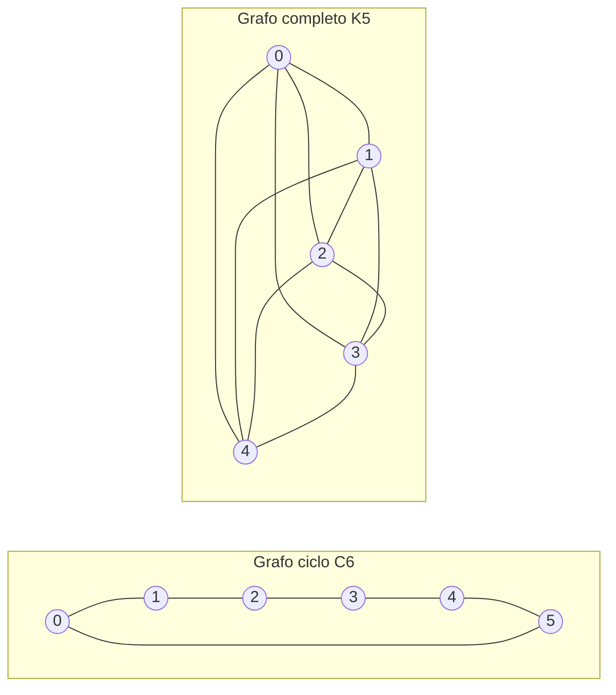

---
navigation:
  order: 20
---

# 2. Preliminares

## 2.1 Reversibilidad y espectro

**Definición 2.1 (Reversibilidad).** Se dice que una matriz de transición \(P\) es reversible respecto de una distribución \(\pi\) si \(\pi(x) P(x,y) = \pi(y) P(y,x)\) se cumple para todos los \(x, y\).

El paseo aleatorio sobre un grafo es reversible, ya que \(\pi(x) P(x,y) = \frac{1}{4|E|}\) cuando hay una arista. Una \(P\) reversible es autoadjunta respecto del producto interno \(\langle f, g \rangle_\pi = \sum_x f(x) g(x) \pi(x)\) y tiene valores propios reales

$$
1 = \lambda_1 > \lambda_2 \ge \cdots \ge \lambda_n \ge -1
$$

En el paseo perezoso, \(P = \frac12 (I + Q)\) (donde \(Q\) es el paseo simple), por lo que todos los valores propios son mayores o iguales que \(0\).

**Definición 2.2 (Brecha espectral).** \(\gamma = 1 - \lambda_2\) se denomina brecha espectral y \(t_{\mathrm{rel}} = 1/\gamma\), tiempo de relajación.

## 2.2 Lema

**Lema 2.3.** Para una \(P\) reversible y cualquier \(x\),

$$
\bigl\| P^t(x,\cdot) - \pi \bigr\|_{\mathrm{TV}} \le \frac{1}{2} \sqrt{\frac{1 - \pi(x)}{\pi(x)}}\; \lambda_\ast^{\,t}, \qquad \lambda_\ast = \max_{i \ge 2} |\lambda_i|.
$$

*Demostración.* Por Cauchy–Schwarz se acota la distancia de variación total mediante la norma \(\ell^2(\pi)\) y se evalúa el desarrollo en valores propios de \(P^t\) tras eliminar el término \(\lambda_1 = 1\). Véanse los detalles en [1, Teorema 12.3]. \(\square\)

## 2.3 Grafos utilizados en los ejemplos

**Figura 1.** El grafo ciclo \(C_6\) (izquierda) y el grafo completo \(K_5\) (derecha). El grafo ciclo tiene un diámetro grande y se mezcla lentamente. El grafo completo se acerca a la distribución uniforme en un solo paso.
