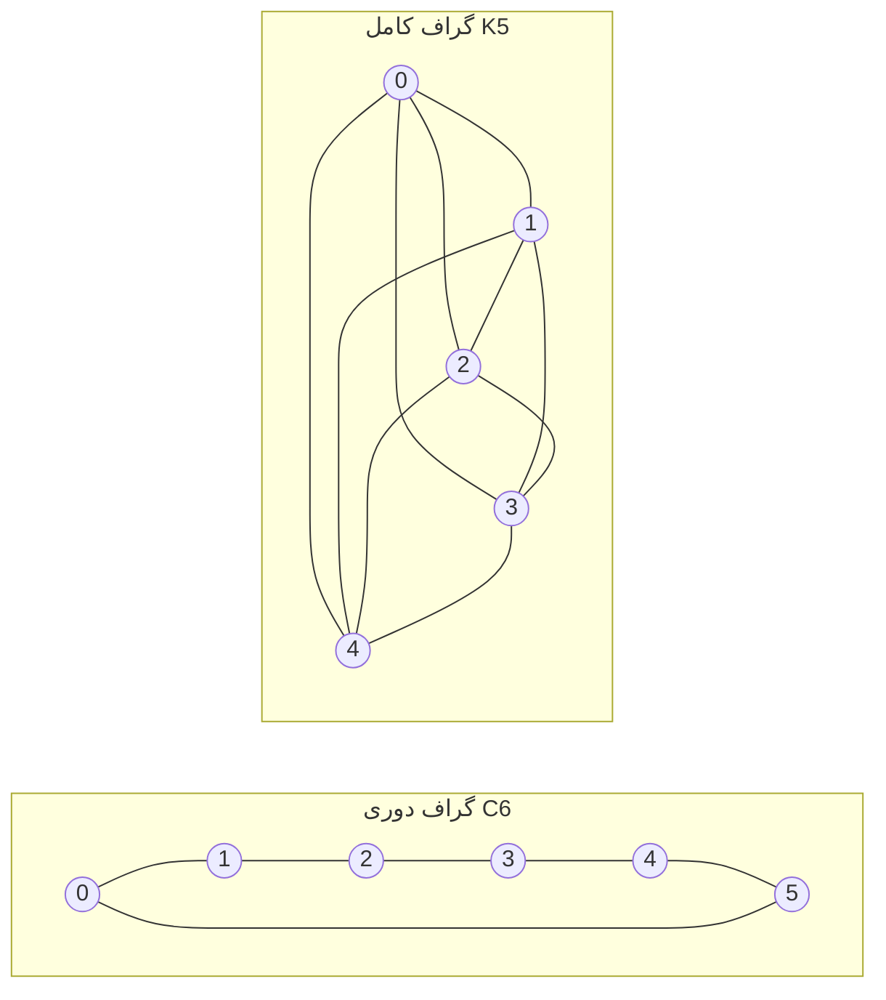

---
navigation:
  order: 20
---

# ۲. مقدمات

## ۲.۱ بازگشت‌پذیری و طیف

**تعریف ۲.۱ (بازگشت‌پذیری).** ماتریس گذار \(P\) نسبت به توزیع \(\pi\) بازگشت‌پذیر است، هرگاه برای همهٔ \(x, y\) رابطهٔ \(\pi(x) P(x,y) = \pi(y) P(y,x)\) برقرار باشد.

گشت تصادفی روی یک گراف بازگشت‌پذیر است، زیرا \(\pi(x) P(x,y) = \frac{1}{4|E|}\) (هنگامی که یالی وجود دارد). یک \(P\) بازگشت‌پذیر نسبت به ضرب داخلی \(\langle f, g \rangle_\pi = \sum_x f(x) g(x) \pi(x)\) خودالحاق است و مقادیر ویژهٔ حقیقی

$$
1 = \lambda_1 > \lambda_2 \ge \cdots \ge \lambda_n \ge -1
$$

دارد. در گشت تنبل \(P = \frac12 (I + Q)\) است (\(Q\) گشت ساده است)، بنابراین همهٔ مقادیر ویژه بزرگ‌تر یا مساوی \(0\) هستند.

**تعریف ۲.۲ (شکاف طیفی).** \(\gamma = 1 - \lambda_2\) را شکاف طیفی و \(t_{\mathrm{rel}} = 1/\gamma\) را زمان آسایش می‌نامند.

## ۲.۲ لم

**لم ۲.۳.** برای \(P\) بازگشت‌پذیر و هر \(x\)

$$
\bigl\| P^t(x,\cdot) - \pi \bigr\|_{\mathrm{TV}} \le \frac{1}{2} \sqrt{\frac{1 - \pi(x)}{\pi(x)}}\; \lambda_\ast^{\,t}, \qquad \lambda_\ast = \max_{i \ge 2} |\lambda_i|.
$$

*اثبات.* با نامساوی کوشی–شوارتس فاصلهٔ تغییرات کل با نُرم \(\ell^2(\pi)\) کران‌دار می‌شود و بسط ویژهٔ \(P^t\) پس از حذف جملهٔ \(\lambda_1 = 1\) ارزیابی می‌گردد. برای جزئیات به [1, قضیهٔ 12.3] مراجعه کنید. \(\square\)

## ۲.۳ گراف‌های به‌کاررفته در مثال‌ها

**شکل ۱.** گراف دوری \(C_6\) (چپ) و گراف کامل \(K_5\) (راست). گراف دوری قطر بزرگی دارد و کند مخلوط می‌شود؛ گراف کامل پس از یک گام به توزیع یکنواخت نزدیک می‌شود.
