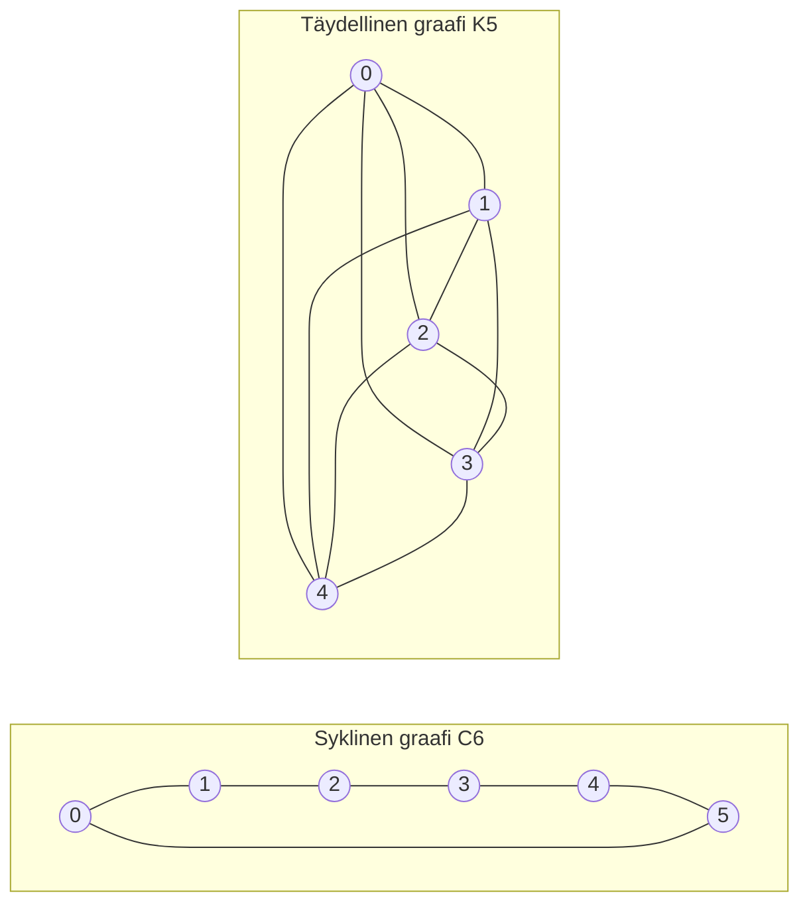

---
navigation:
  order: 20
---

# 2. Valmistelut

## 2.1 Kääntyvyys ja spektri

**Määritelmä 2.1 (kääntyvyys).** Siirtymämatriisi \(P\) on kääntyvä jakauman \(\pi\) suhteen, jos \(\pi(x) P(x,y) = \pi(y) P(y,x)\) pätee kaikilla \(x, y\).

Satunnaiskulku graafilla on kääntyvä, sillä \(\pi(x) P(x,y) = \frac{1}{4|E|}\), kun \(x\):n ja \(y\):n välillä on särmä. Kääntyvä \(P\) on itseadjungoitu sisätulon \(\langle f, g \rangle_\pi = \sum_x f(x) g(x) \pi(x)\) suhteen, ja sillä on reaaliset ominaisarvot

$$
1 = \lambda_1 > \lambda_2 \ge \cdots \ge \lambda_n \ge -1
$$

Laiskassa kulussa \(P = \frac12 (I + Q)\), missä \(Q\) on yksinkertainen kulku, joten jokainen ominaisarvo on vähintään \(0\).

**Määritelmä 2.2 (spektriväli).** \(\gamma = 1 - \lambda_2\) on spektriväli ja \(t_{\mathrm{rel}} = 1/\gamma\) relaksaatioaika.

## 2.2 Lemma

**Lemma 2.3.** Kääntyvälle \(P\):lle ja mielivaltaiselle \(x\):lle

$$
\bigl\| P^t(x,\cdot) - \pi \bigr\|_{\mathrm{TV}} \le \frac{1}{2} \sqrt{\frac{1 - \pi(x)}{\pi(x)}}\; \lambda_\ast^{\,t}, \qquad \lambda_\ast = \max_{i \ge 2} |\lambda_i|.
$$

*Todistus.* Cauchyn–Schwarzin epäyhtälö rajoittaa kokonaisvaihteluetäisyyden \(\ell^2(\pi)\)-normilla, ja \(P^t\):n ominaiskehitelmää arvioidaan sen jälkeen, kun termi \(\lambda_1 = 1\) on poistettu. Yksityiskohdat ovat lähteessä [1, lause 12.3]. \(\square\)

## 2.3 Esimerkeissä käytettävät graafit

**Kuva 1.** Syklinen graafi \(C_6\) (vasemmalla) ja täydellinen graafi \(K_5\) (oikealla). Syklisellä graafilla on suuri halkaisija ja se sekoittuu hitaasti. Täydellinen graafi lähestyy tasajakaumaa yhdellä askeleella.
