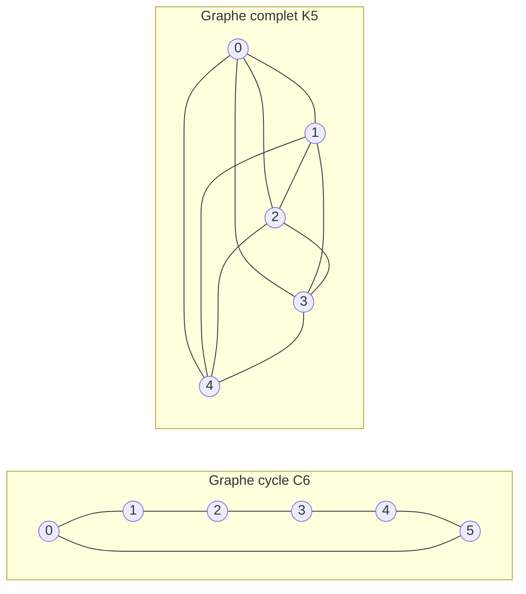

---
navigation:
  order: 20
---

# 2. Préliminaires

## 2.1 Réversibilité et spectre

**Définition 2.1 (Réversibilité).** Une matrice de transition \(P\) est dite réversible par rapport à une distribution \(\pi\) si \(\pi(x) P(x,y) = \pi(y) P(y,x)\) pour tous \(x, y\).

La marche aléatoire sur un graphe est réversible, car \(\pi(x) P(x,y) = \frac{1}{4|E|}\) dès qu'une arête est présente. Un \(P\) réversible est auto-adjoint pour le produit scalaire \(\langle f, g \rangle_\pi = \sum_x f(x) g(x) \pi(x)\) et possède des valeurs propres réelles

$$
1 = \lambda_1 > \lambda_2 \ge \cdots \ge \lambda_n \ge -1
$$

Pour la marche paresseuse, \(P = \frac12 (I + Q)\) où \(Q\) est la marche simple, de sorte que toutes les valeurs propres sont supérieures ou égales à \(0\).

**Définition 2.2 (Trou spectral).** \(\gamma = 1 - \lambda_2\) est appelé le trou spectral, et \(t_{\mathrm{rel}} = 1/\gamma\) le temps de relaxation.

## 2.2 Lemme

**Lemme 2.3.** Pour un \(P\) réversible et pour tout \(x\),

$$
\bigl\| P^t(x,\cdot) - \pi \bigr\|_{\mathrm{TV}} \le \frac{1}{2} \sqrt{\frac{1 - \pi(x)}{\pi(x)}}\; \lambda_\ast^{\,t}, \qquad \lambda_\ast = \max_{i \ge 2} |\lambda_i|.
$$

*Démonstration.* L'inégalité de Cauchy–Schwarz majore la distance en variation totale par la norme \(\ell^2(\pi)\), et l'on évalue le développement spectral de \(P^t\) après en avoir retiré le terme \(\lambda_1 = 1\). Voir [1, théorème 12.3] pour les détails. \(\square\)

## 2.3 Les graphes utilisés dans les exemples

**Figure 1.** Le graphe cycle \(C_6\) (à gauche) et le graphe complet \(K_5\) (à droite). Le graphe cycle a un grand diamètre et mélange lentement. Le graphe complet s'approche de l'uniforme en un seul pas.
