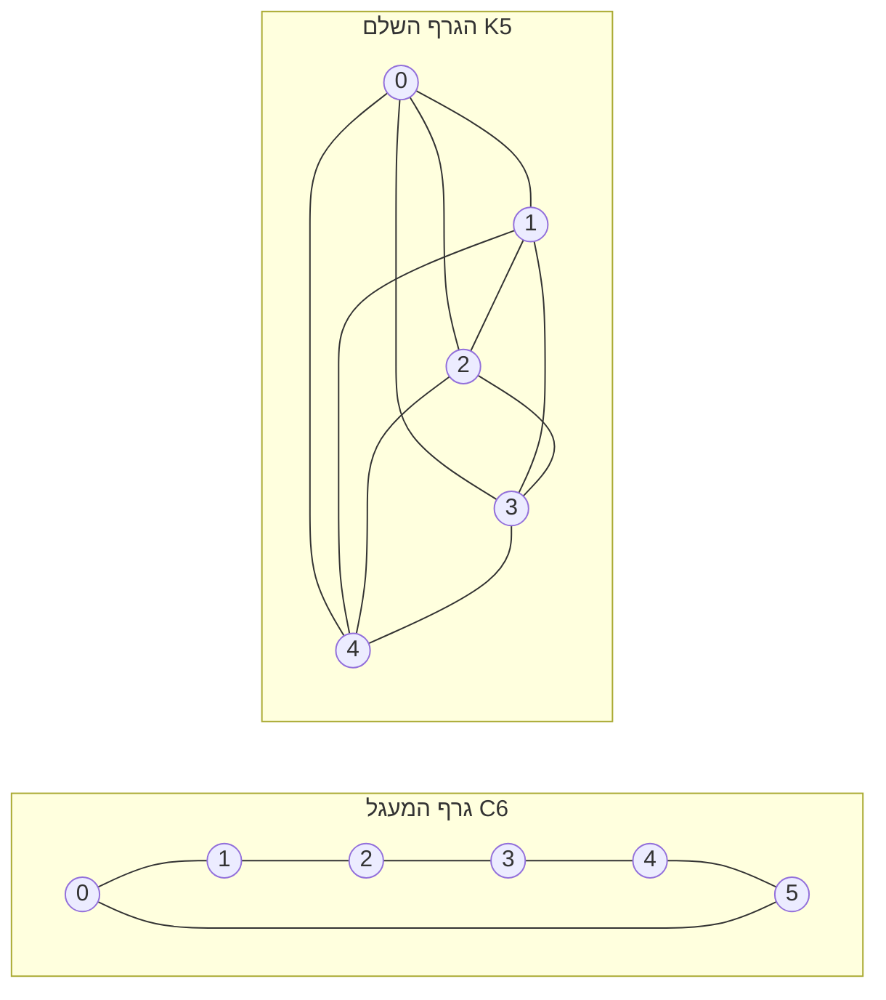

---
navigation:
  order: 20
---

# 2. הכנות

## 2.1 הפיכות וספקטרום

**הגדרה 2.1 (הפיכות).** מטריצת מעבר \(P\) נקראת הפיכה ביחס להתפלגות \(\pi\) אם לכל \(x, y\) מתקיים \(\pi(x) P(x,y) = \pi(y) P(y,x)\).

ההילוך המקרי על גרף הוא הפיך, שכן \(\pi(x) P(x,y) = \frac{1}{4|E|}\) כאשר קיימת קשת. מטריצה הפיכה \(P\) היא צמודה לעצמה ביחס למכפלה הפנימית \(\langle f, g \rangle_\pi = \sum_x f(x) g(x) \pi(x)\), ויש לה ערכים עצמיים ממשיים

$$
1 = \lambda_1 > \lambda_2 \ge \cdots \ge \lambda_n \ge -1
$$

בהילוך העצל מתקיים \(P = \frac12 (I + Q)\) (כאשר \(Q\) הוא ההילוך הפשוט), ולכן כל הערכים העצמיים הם \(0\) או יותר.

**הגדרה 2.2 (מרווח ספקטרלי).** \(\gamma = 1 - \lambda_2\) נקרא המרווח הספקטרלי, ו‑\(t_{\mathrm{rel}} = 1/\gamma\) נקרא זמן ההרפיה.

## 2.2 למה

**למה 2.3.** עבור \(P\) הפיכה ועבור כל \(x\),

$$
\bigl\| P^t(x,\cdot) - \pi \bigr\|_{\mathrm{TV}} \le \frac{1}{2} \sqrt{\frac{1 - \pi(x)}{\pi(x)}}\; \lambda_\ast^{\,t}, \qquad \lambda_\ast = \max_{i \ge 2} |\lambda_i|.
$$

*הוכחה.* אי‑שוויון קושי–שוורץ חוסם את מרחק השונות הכוללת באמצעות נורמת \(\ell^2(\pi)\), ואת הפיתוח לפי הערכים העצמיים של \(P^t\) מעריכים לאחר הסרת האיבר \(\lambda_1 = 1\). לפרטים ראו [1, משפט 12.3]. \(\square\)

## 2.3 הגרפים המשמשים בדוגמאות

**איור 1.** גרף המעגל \(C_6\) (משמאל) והגרף השלם \(K_5\) (מימין). לגרף המעגל קוטר גדול והערבוב בו איטי. הגרף השלם מתקרב להתפלגות האחידה בצעד אחד.
