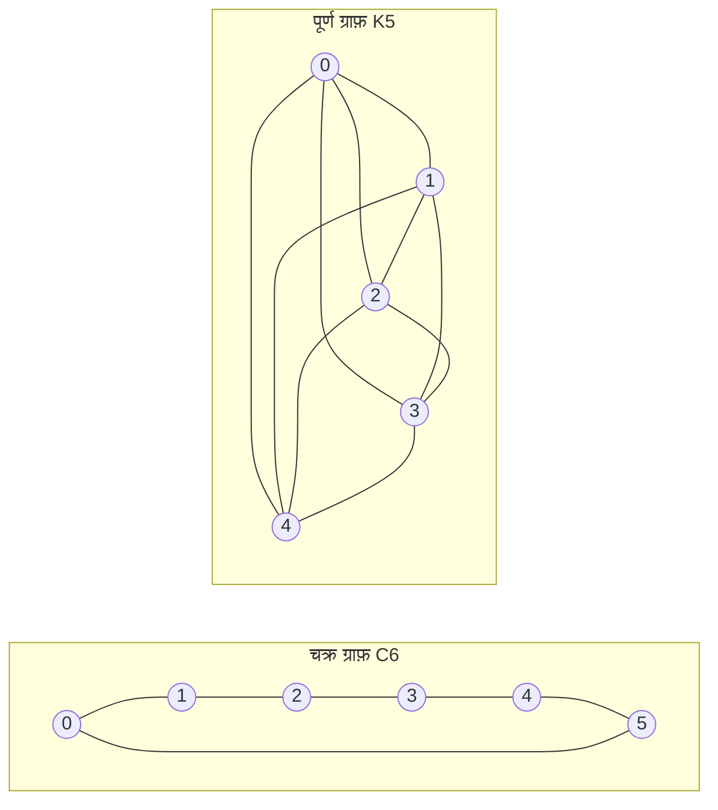

---
navigation:
  order: 20
---

# 2. पूर्वापेक्षाएँ

## 2.1 प्रतिवर्तीयता और स्पेक्ट्रम

**परिभाषा 2.1 (प्रतिवर्तीयता).** संक्रमण आव्यूह \(P\) को वितरण \(\pi\) के सापेक्ष प्रतिवर्ती कहा जाता है जब सभी \(x, y\) के लिए \(\pi(x) P(x,y) = \pi(y) P(y,x)\) सत्य हो।

ग्राफ़ पर यादृच्छिक चहलक़दमी प्रतिवर्ती है, क्योंकि \(\pi(x) P(x,y) = \frac{1}{4|E|}\) (जब कोई कोर होती है)। प्रतिवर्ती \(P\) अंतर्गुणन \(\langle f, g \rangle_\pi = \sum_x f(x) g(x) \pi(x)\) के सापेक्ष स्वसंलग्न होता है और उसके वास्तविक आइगेनमान

$$
1 = \lambda_1 > \lambda_2 \ge \cdots \ge \lambda_n \ge -1
$$

होते हैं। विलंबित चहलक़दमी में \(P = \frac12 (I + Q)\) होता है (यहाँ \(Q\) सरल चहलक़दमी है), इसलिए सभी आइगेनमान \(0\) या उससे अधिक होते हैं।

**परिभाषा 2.2 (स्पेक्ट्रल अंतराल).** \(\gamma = 1 - \lambda_2\) को स्पेक्ट्रल अंतराल और \(t_{\mathrm{rel}} = 1/\gamma\) को विश्रांति काल कहते हैं।

## 2.2 प्रमेयिका

**प्रमेयिका 2.3.** प्रतिवर्ती \(P\) और किसी भी \(x\) के लिए

$$
\bigl\| P^t(x,\cdot) - \pi \bigr\|_{\mathrm{TV}} \le \frac{1}{2} \sqrt{\frac{1 - \pi(x)}{\pi(x)}}\; \lambda_\ast^{\,t}, \qquad \lambda_\ast = \max_{i \ge 2} |\lambda_i|.
$$

*उपपत्ति.* Cauchy–Schwarz द्वारा सम्पूर्ण विचरण दूरी को \(\ell^2(\pi)\) मानक से परिबद्ध किया जाता है, और \(P^t\) के आइगेन-प्रसार में \(\lambda_1 = 1\) वाला पद हटाकर शेष का आकलन किया जाता है। विस्तार के लिए [1, प्रमेय 12.3] देखें। \(\square\)

## 2.3 उदाहरणों में प्रयुक्त ग्राफ़

**आरेख 1.** चक्र ग्राफ़ \(C_6\) (बाएँ) और पूर्ण ग्राफ़ \(K_5\) (दाएँ)। चक्र ग्राफ़ का व्यास बड़ा होता है और उसका मिश्रण धीमा होता है। पूर्ण ग्राफ़ एक ही चरण में एकसमान वितरण के निकट पहुँच जाता है।
