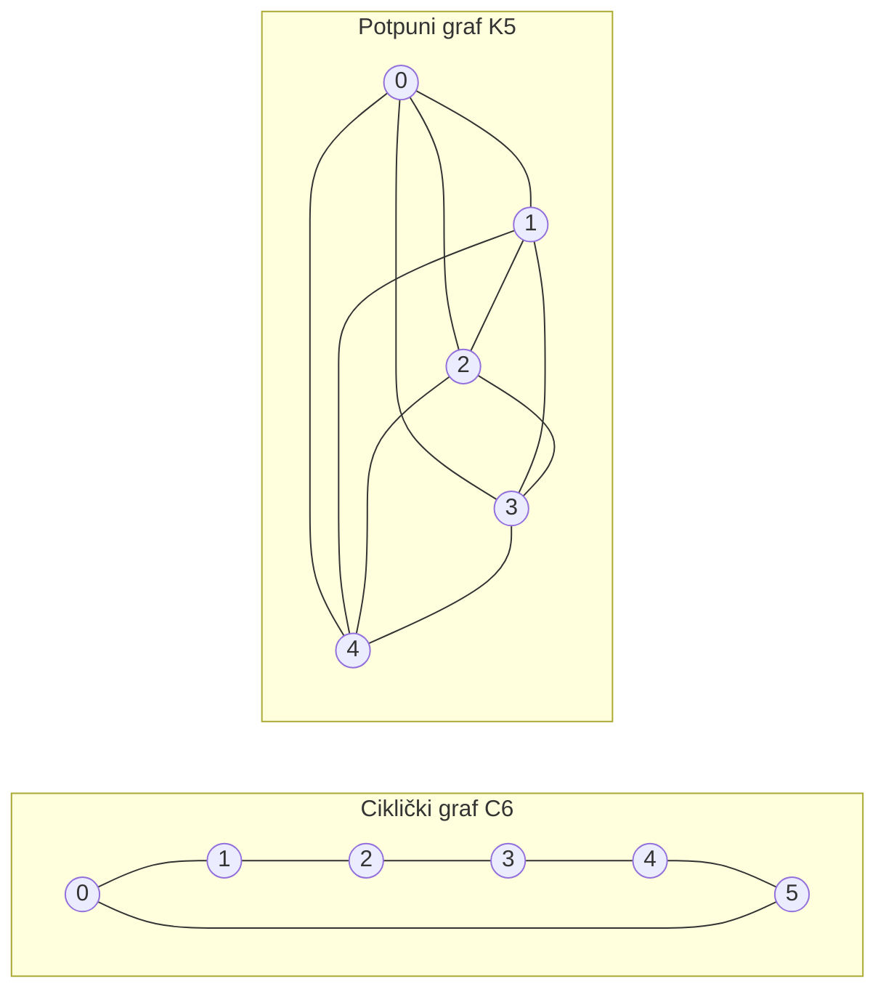

---
navigation:
  order: 20
---

# 2. Priprema

## 2.1 Reverzibilnost i spektar

**Definicija 2.1 (Reverzibilnost).** Za prijelaznu matricu \(P\) kažemo da je reverzibilna s obzirom na distribuciju \(\pi\) ako za sve \(x, y\) vrijedi \(\pi(x) P(x,y) = \pi(y) P(y,x)\).

Slučajna šetnja na grafu reverzibilna je jer je \(\pi(x) P(x,y) = \frac{1}{4|E|}\) (kada postoji brid). Reverzibilna matrica \(P\) samoadjungirana je s obzirom na skalarni produkt \(\langle f, g \rangle_\pi = \sum_x f(x) g(x) \pi(x)\) i ima realne svojstvene vrijednosti

$$
1 = \lambda_1 > \lambda_2 \ge \cdots \ge \lambda_n \ge -1
$$

Kod lijene šetnje je \(P = \frac12 (I + Q)\) (gdje je \(Q\) jednostavna šetnja), pa su sve svojstvene vrijednosti veće ili jednake \(0\).

**Definicija 2.2 (Spektralni procjep).** \(\gamma = 1 - \lambda_2\) naziva se spektralni procjep, a \(t_{\mathrm{rel}} = 1/\gamma\) vrijeme relaksacije.

## 2.2 Lema

**Lema 2.3.** Za reverzibilnu matricu \(P\) i proizvoljan \(x\) vrijedi

$$
\bigl\| P^t(x,\cdot) - \pi \bigr\|_{\mathrm{TV}} \le \frac{1}{2} \sqrt{\frac{1 - \pi(x)}{\pi(x)}}\; \lambda_\ast^{\,t}, \qquad \lambda_\ast = \max_{i \ge 2} |\lambda_i|.
$$

*Dokaz.* Cauchy–Schwarzovom nejednakošću ograničava se udaljenost u totalnoj varijaciji normom \(\ell^2(\pi)\), a zatim se procjenjuje svojstveni razvoj od \(P^t\) nakon uklanjanja člana s \(\lambda_1 = 1\). Za pojedinosti vidi [1, teorem 12.3]. \(\square\)

## 2.3 Grafovi korišteni u primjerima

**Slika 1.** Ciklički graf \(C_6\) (lijevo) i potpuni graf \(K_5\) (desno). Ciklički graf ima velik promjer i sporo se miješa. Potpuni graf u jednom se koraku približi uniformnoj distribuciji.
