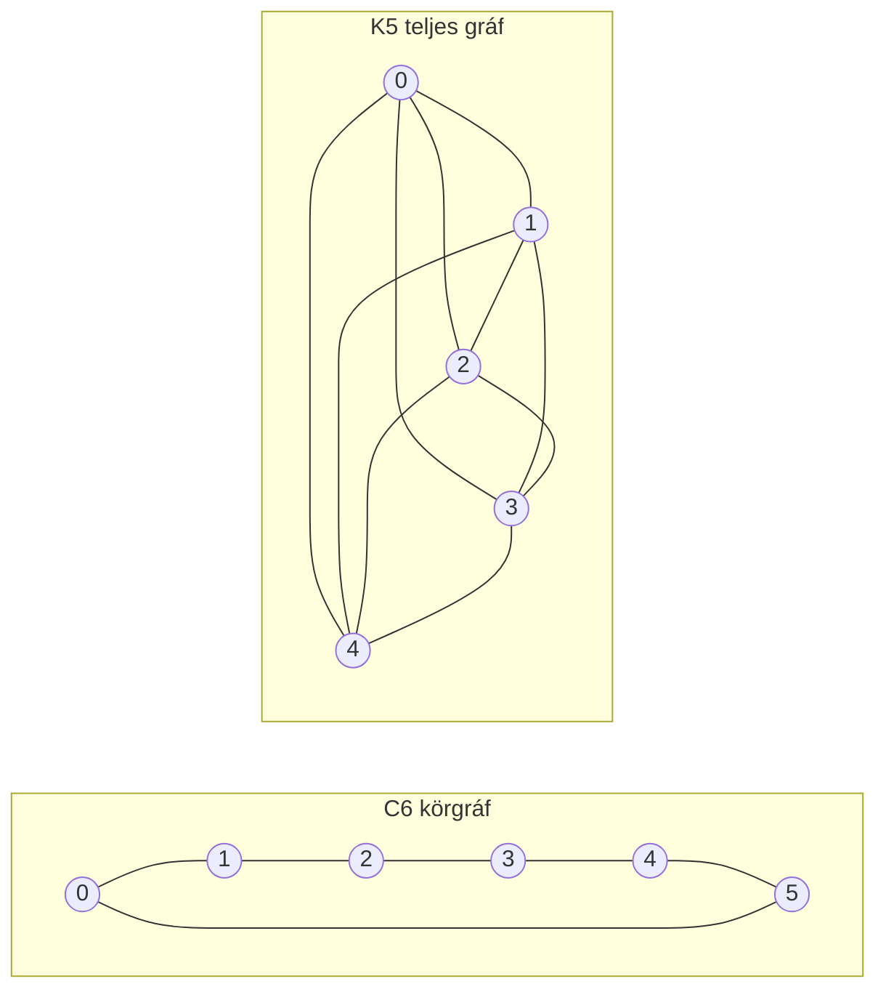

---
navigation:
  order: 20
---

# 2. Előkészületek

## 2.1 Reverzibilitás és spektrum

**2.1. definíció (Reverzibilitás).** A \(P\) átmenetmátrix akkor reverzibilis a \(\pi\) eloszlásra nézve, ha minden \(x, y\) esetén teljesül, hogy \(\pi(x) P(x,y) = \pi(y) P(y,x)\).

A gráfon vett véletlen bolyongás reverzibilis, mivel \(\pi(x) P(x,y) = \frac{1}{4|E|}\) (ha van él). A reverzibilis \(P\) önadjungált a \(\langle f, g \rangle_\pi = \sum_x f(x) g(x) \pi(x)\) skaláris szorzatra nézve, és valós sajátértékei vannak:

$$
1 = \lambda_1 > \lambda_2 \ge \cdots \ge \lambda_n \ge -1
$$

A késleltetett bolyongásnál \(P = \frac12 (I + Q)\) (ahol \(Q\) az egyszerű bolyongás), ezért minden sajátérték legalább \(0\).

**2.2. definíció (Spektrális rés).** A \(\gamma = 1 - \lambda_2\) mennyiséget spektrális résnek, a \(t_{\mathrm{rel}} = 1/\gamma\) mennyiséget relaxációs időnek nevezzük.

## 2.2 Lemma

**2.3. lemma.** Reverzibilis \(P\) és tetszőleges \(x\) esetén

$$
\bigl\| P^t(x,\cdot) - \pi \bigr\|_{\mathrm{TV}} \le \frac{1}{2} \sqrt{\frac{1 - \pi(x)}{\pi(x)}}\; \lambda_\ast^{\,t}, \qquad \lambda_\ast = \max_{i \ge 2} |\lambda_i|.
$$

*Bizonyítás.* A Cauchy–Schwarz-egyenlőtlenséggel a teljes variációs távolságot az \(\ell^2(\pi)\) normával becsüljük felülről, majd \(P^t\) sajátérték-kifejtésében a \(\lambda_1 = 1\) tag elhagyása után maradó részt értékeljük ki. A részletekért lásd: [1, 12.3. tétel]. \(\square\)

## 2.3 A példákban használt gráfok

**1. ábra.** A \(C_6\) körgráf (balra) és a \(K_5\) teljes gráf (jobbra). A körgráf átmérője nagy, ezért lassan keveredik. A teljes gráf egyetlen lépésben megközelíti az egyenletes eloszlást.
