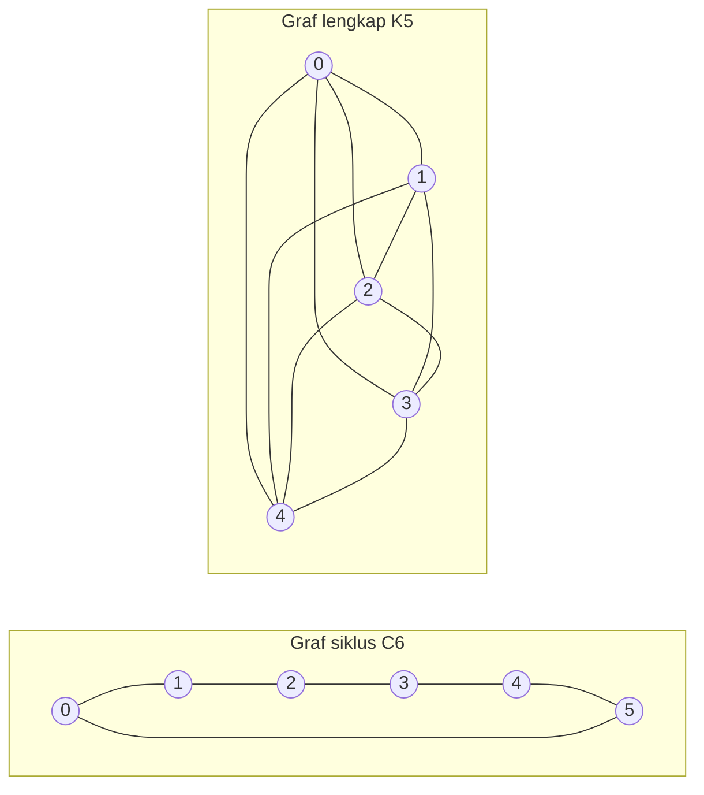

---
navigation:
  order: 20
---

# 2. Persiapan

## 2.1 Keterbalikan dan spektrum

**Definisi 2.1 (Keterbalikan).** Matriks transisi \(P\) disebut terbalikkan terhadap distribusi \(\pi\) apabila \(\pi(x) P(x,y) = \pi(y) P(y,x)\) berlaku untuk semua \(x, y\).

Jalan acak pada graf bersifat terbalikkan, karena \(\pi(x) P(x,y) = \frac{1}{4|E|}\) (bila ada sisi). Matriks \(P\) yang terbalikkan bersifat swa-adjoin terhadap hasil kali dalam \(\langle f, g \rangle_\pi = \sum_x f(x) g(x) \pi(x)\), dan memiliki nilai eigen real

$$
1 = \lambda_1 > \lambda_2 \ge \cdots \ge \lambda_n \ge -1
$$

Pada jalan malas, \(P = \frac12 (I + Q)\) dengan \(Q\) adalah jalan sederhana, sehingga semua nilai eigen bernilai \(0\) atau lebih.

**Definisi 2.2 (Celah spektral).** \(\gamma = 1 - \lambda_2\) disebut celah spektral, dan \(t_{\mathrm{rel}} = 1/\gamma\) disebut waktu relaksasi.

## 2.2 Lema

**Lema 2.3.** Untuk \(P\) yang terbalikkan dan sebarang \(x\),

$$
\bigl\| P^t(x,\cdot) - \pi \bigr\|_{\mathrm{TV}} \le \frac{1}{2} \sqrt{\frac{1 - \pi(x)}{\pi(x)}}\; \lambda_\ast^{\,t}, \qquad \lambda_\ast = \max_{i \ge 2} |\lambda_i|.
$$

*Bukti.* Dengan Cauchy–Schwarz, jarak variasi total dibatasi oleh norma \(\ell^2(\pi)\), lalu ekspansi eigen dari \(P^t\) dievaluasi setelah suku \(\lambda_1 = 1\) dikeluarkan. Rinciannya lihat [1, Teorema 12.3]. \(\square\)

## 2.3 Graf yang dipakai pada contoh

**Gambar 1.** Graf siklus \(C_6\) (kiri) dan graf lengkap \(K_5\) (kanan). Graf siklus memiliki diameter besar sehingga pencampurannya lambat. Graf lengkap mendekati sebaran seragam dalam satu langkah.
