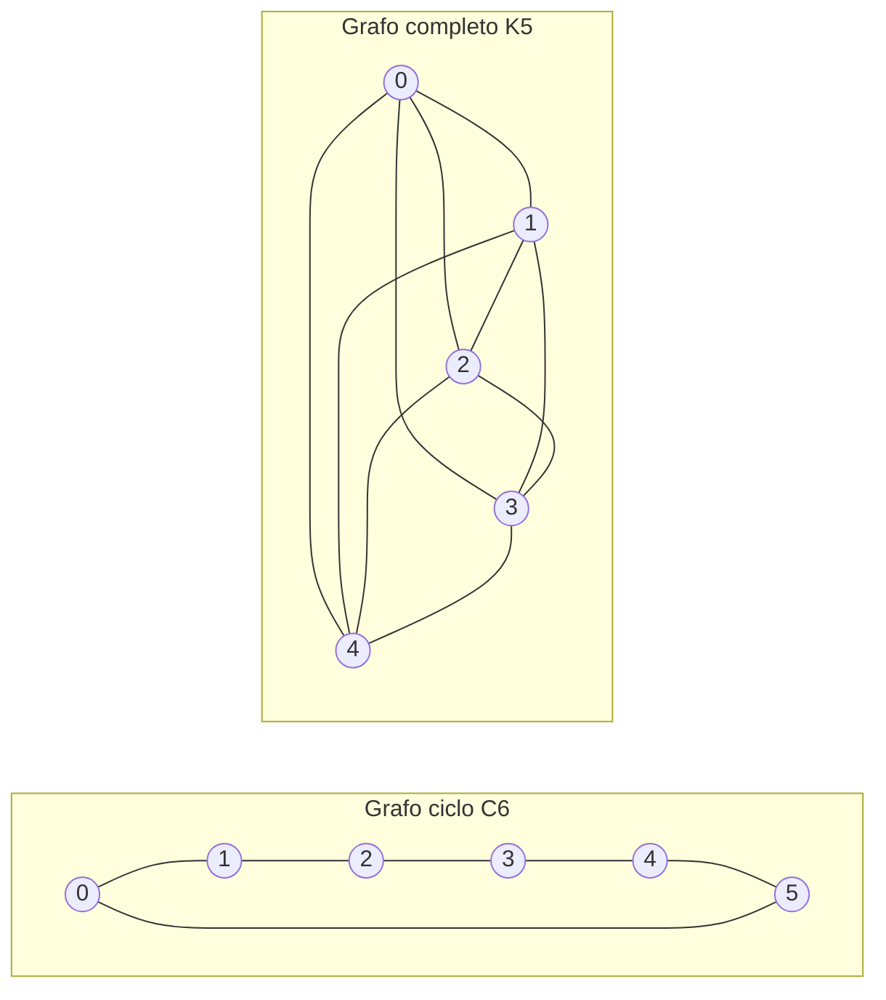

---
navigation:
  order: 20
---

# 2. Preliminari

## 2.1 Reversibilità e spettro

**Definizione 2.1 (Reversibilità).** Una matrice di transizione \(P\) si dice reversibile rispetto a una distribuzione \(\pi\) se \(\pi(x) P(x,y) = \pi(y) P(y,x)\) vale per ogni \(x, y\).

La passeggiata aleatoria su un grafo è reversibile, poiché \(\pi(x) P(x,y) = \frac{1}{4|E|}\) quando un lato congiunge \(x\) e \(y\). Una \(P\) reversibile è autoaggiunta rispetto al prodotto interno \(\langle f, g \rangle_\pi = \sum_x f(x) g(x) \pi(x)\) e ha autovalori reali

$$
1 = \lambda_1 > \lambda_2 \ge \cdots \ge \lambda_n \ge -1
$$

Nella passeggiata pigra si ha \(P = \frac12 (I + Q)\), dove \(Q\) è la passeggiata semplice, quindi ogni autovalore è maggiore o uguale a \(0\).

**Definizione 2.2 (Gap spettrale).** \(\gamma = 1 - \lambda_2\) si chiama gap spettrale e \(t_{\mathrm{rel}} = 1/\gamma\) tempo di rilassamento.

## 2.2 Lemma

**Lemma 2.3.** Per una \(P\) reversibile e per ogni \(x\),

$$
\bigl\| P^t(x,\cdot) - \pi \bigr\|_{\mathrm{TV}} \le \frac{1}{2} \sqrt{\frac{1 - \pi(x)}{\pi(x)}}\; \lambda_\ast^{\,t}, \qquad \lambda_\ast = \max_{i \ge 2} |\lambda_i|.
$$

*Dimostrazione.* Con la disuguaglianza di Cauchy–Schwarz si maggiora la distanza in variazione totale mediante la norma \(\ell^2(\pi)\), e si valuta lo sviluppo in autovalori di \(P^t\) dopo aver rimosso il termine \(\lambda_1 = 1\). Per i dettagli si veda [1, Teorema 12.3]. \(\square\)

## 2.3 I grafi usati negli esempi

**Figura 1.** Il grafo ciclo \(C_6\) (a sinistra) e il grafo completo \(K_5\) (a destra). Il grafo ciclo ha un diametro grande e si mescola lentamente; il grafo completo si avvicina alla distribuzione uniforme in un solo passo.
