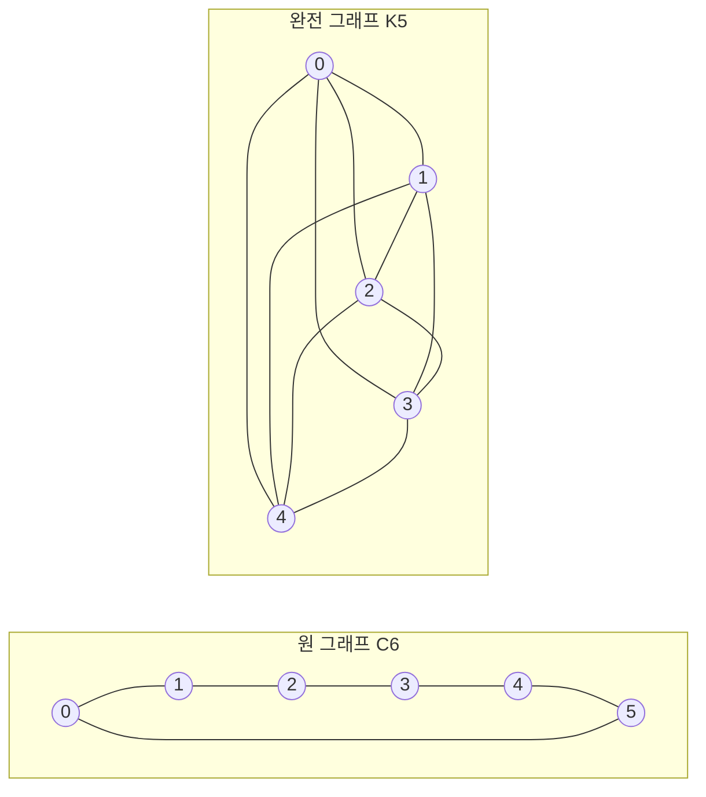

---
navigation:
  order: 20
---

# 2. 준비

## 2.1 가역성과 스펙트럼

**정의 2.1(가역성).** 전이 행렬 \(P\)가 분포 \(\pi\)에 관하여 가역이라는 것은, 모든 \(x, y\)에 대하여 \(\pi(x) P(x,y) = \pi(y) P(y,x)\)가 성립함을 말한다.

그래프 위의 랜덤 워크는 \(\pi(x) P(x,y) = \frac{1}{4|E|}\)(변이 있을 때)에 의해 가역이다. 가역인 \(P\)는 내적 \(\langle f, g \rangle_\pi = \sum_x f(x) g(x) \pi(x)\)에 관하여 자기수반이며, 실고윳값

$$
1 = \lambda_1 > \lambda_2 \ge \cdots \ge \lambda_n \ge -1
$$

을 가진다. 지연 워크에서는 \(P = \frac12 (I + Q)\)(\(Q\)는 단순 워크)이므로, 모든 고윳값은 \(0\) 이상이다.

**정의 2.2(스펙트럼 간극).** \(\gamma = 1 - \lambda_2\)를 스펙트럼 간극, \(t_{\mathrm{rel}} = 1/\gamma\)를 완화 시간이라고 한다.

## 2.2 보조정리

**보조정리 2.3.** 가역인 \(P\)와 임의의 \(x\)에 대하여

$$
\bigl\| P^t(x,\cdot) - \pi \bigr\|_{\mathrm{TV}} \le \frac{1}{2} \sqrt{\frac{1 - \pi(x)}{\pi(x)}}\; \lambda_\ast^{\,t}, \qquad \lambda_\ast = \max_{i \ge 2} |\lambda_i|.
$$

*증명.* Cauchy–Schwarz에 의해 전변동 거리를 \(\ell^2(\pi)\) 노름으로 억제하고, \(P^t\)의 고유 전개에서 \(\lambda_1 = 1\)인 항을 제외한 나머지를 평가한다. 자세한 내용은 [1, 정리 12.3]을 참조하라. \(\square\)

## 2.3 예에 사용하는 그래프

**그림 1.** 원 그래프 \(C_6\)(왼쪽)와 완전 그래프 \(K_5\)(오른쪽). 원 그래프는 지름이 커서 혼합이 느리다. 완전 그래프는 1보 만에 균일 분포에 가까워진다.
