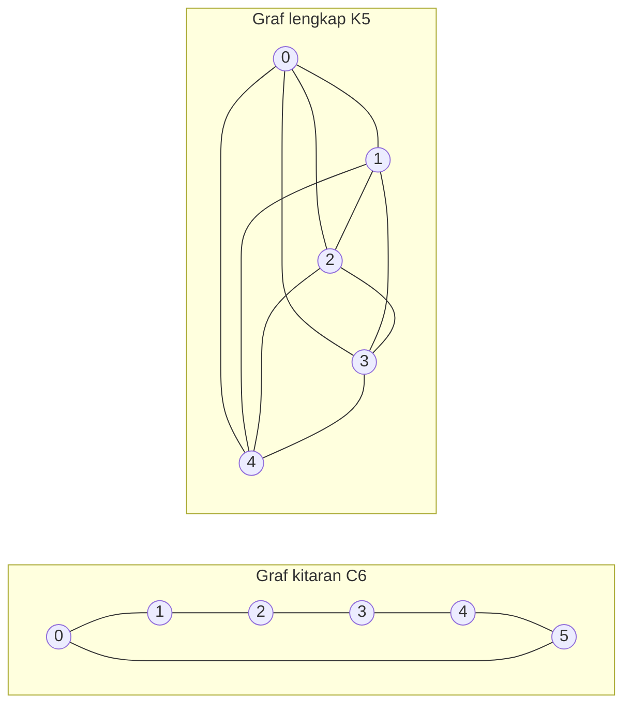

---
navigation:
  order: 20
---

# 2. Persediaan

## 2.1 Keterbalikan dan spektrum

**Definisi 2.1 (Keterbalikan).** Matriks peralihan \(P\) dikatakan terbalikkan terhadap taburan \(\pi\) apabila \(\pi(x) P(x,y) = \pi(y) P(y,x)\) berlaku bagi semua \(x, y\).

Perjalanan rawak pada graf adalah terbalikkan kerana \(\pi(x) P(x,y) = \frac{1}{4|E|}\) (apabila wujud tepi). Matriks \(P\) yang terbalikkan adalah swaadjoin terhadap hasil darab dalam \(\langle f, g \rangle_\pi = \sum_x f(x) g(x) \pi(x)\), dan mempunyai nilai eigen nyata

$$
1 = \lambda_1 > \lambda_2 \ge \cdots \ge \lambda_n \ge -1
$$

Bagi perjalanan malas, \(P = \frac12 (I + Q)\) (dengan \(Q\) ialah perjalanan mudah), maka setiap nilai eigen adalah \(0\) atau lebih.

**Definisi 2.2 (Jurang spektrum).** \(\gamma = 1 - \lambda_2\) disebut jurang spektrum, dan \(t_{\mathrm{rel}} = 1/\gamma\) disebut masa relaksasi.

## 2.2 Lema

**Lema 2.3.** Bagi \(P\) yang terbalikkan dan sebarang \(x\),

$$
\bigl\| P^t(x,\cdot) - \pi \bigr\|_{\mathrm{TV}} \le \frac{1}{2} \sqrt{\frac{1 - \pi(x)}{\pi(x)}}\; \lambda_\ast^{\,t}, \qquad \lambda_\ast = \max_{i \ge 2} |\lambda_i|.
$$

*Bukti.* Dengan Cauchy–Schwarz, jarak variasi total dibatasi oleh norma \(\ell^2(\pi)\), dan bakinya dinilai daripada kembangan eigen \(P^t\) setelah sebutan \(\lambda_1 = 1\) dibuang. Untuk perinciannya, lihat [1, Teorem 12.3]. \(\square\)

## 2.3 Graf yang digunakan dalam contoh

**Rajah 1.** Graf kitaran \(C_6\) (kiri) dan graf lengkap \(K_5\) (kanan). Graf kitaran mempunyai diameter yang besar dan bercampur dengan perlahan. Graf lengkap menghampiri taburan seragam dalam satu langkah.
