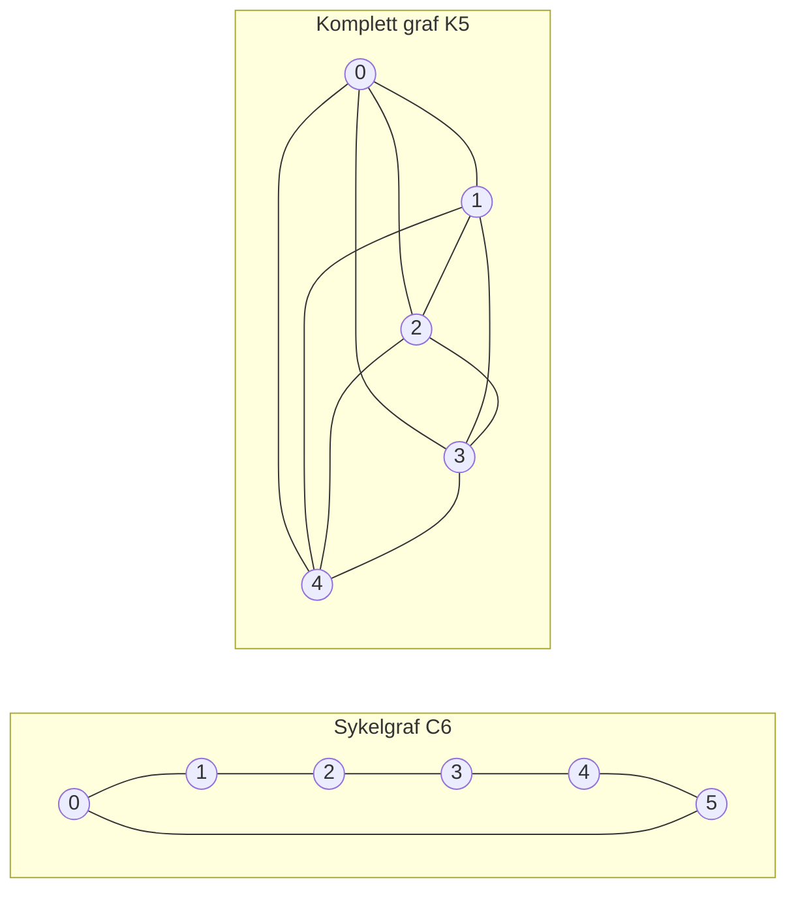

---
navigation:
  order: 20
---

# 2. Forberedelser

## 2.1 Reversibilitet og spektrum

**Definisjon 2.1 (Reversibilitet).** En overgangsmatrise \(P\) er reversibel med hensyn på en fordeling \(\pi\) dersom \(\pi(x) P(x,y) = \pi(y) P(y,x)\) gjelder for alle \(x, y\).

Tilfeldig gange på en graf er reversibel, siden \(\pi(x) P(x,y) = \frac{1}{4|E|}\) når det finnes en kant. En reversibel \(P\) er selvadjungert med hensyn på indreproduktet \(\langle f, g \rangle_\pi = \sum_x f(x) g(x) \pi(x)\) og har reelle egenverdier

$$
1 = \lambda_1 > \lambda_2 \ge \cdots \ge \lambda_n \ge -1
$$

For den late gangen er \(P = \frac12 (I + Q)\), der \(Q\) er den enkle gangen, så alle egenverdiene er minst \(0\).

**Definisjon 2.2 (Spektralgap).** \(\gamma = 1 - \lambda_2\) kalles spektralgapet, og \(t_{\mathrm{rel}} = 1/\gamma\) relaksasjonstiden.

## 2.2 Lemma

**Lemma 2.3.** For en reversibel \(P\) og enhver \(x\) gjelder

$$
\bigl\| P^t(x,\cdot) - \pi \bigr\|_{\mathrm{TV}} \le \frac{1}{2} \sqrt{\frac{1 - \pi(x)}{\pi(x)}}\; \lambda_\ast^{\,t}, \qquad \lambda_\ast = \max_{i \ge 2} |\lambda_i|.
$$

*Bevis.* Cauchy–Schwarz begrenser totalvariasjonsavstanden med \(\ell^2(\pi)\)-normen, og egenutviklingen av \(P^t\) vurderes etter at leddet med \(\lambda_1 = 1\) er fjernet. Se [1, teorem 12.3] for detaljer. \(\square\)

## 2.3 Grafene som brukes i eksemplene

**Figur 1.** Sykelgrafen \(C_6\) (til venstre) og den komplette grafen \(K_5\) (til høyre). Sykelgrafen har stor diameter og blander seg langsomt. Den komplette grafen nærmer seg det uniforme på ett steg.
