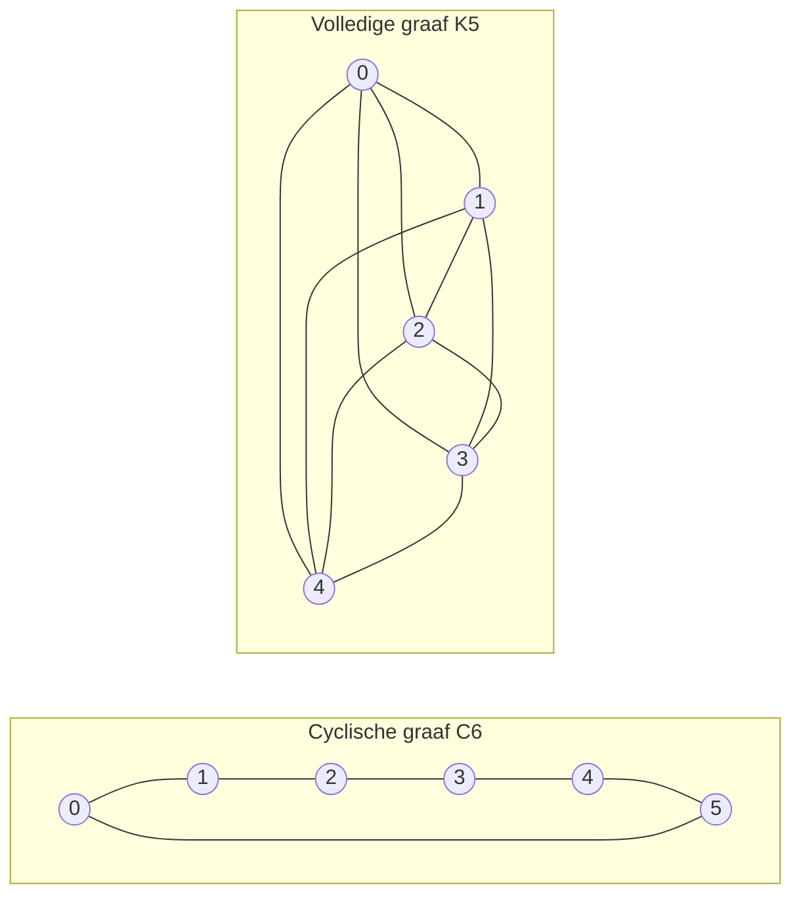

---
navigation:
  order: 20
---

# 2. Voorbereiding

## 2.1 Omkeerbaarheid en spectrum

**Definitie 2.1 (Omkeerbaarheid).** Een overgangsmatrix \(P\) heet omkeerbaar ten opzichte van een verdeling \(\pi\) wanneer \(\pi(x) P(x,y) = \pi(y) P(y,x)\) geldt voor alle \(x, y\).

De stochastische wandeling op een graaf is omkeerbaar, omdat \(\pi(x) P(x,y) = \frac{1}{4|E|}\) (wanneer er een kant is). Een omkeerbare \(P\) is zelftoegevoegd ten opzichte van het inproduct \(\langle f, g \rangle_\pi = \sum_x f(x) g(x) \pi(x)\) en heeft reële eigenwaarden

$$
1 = \lambda_1 > \lambda_2 \ge \cdots \ge \lambda_n \ge -1
$$

Bij de luie wandeling is \(P = \frac12 (I + Q)\) (met \(Q\) de eenvoudige wandeling), dus alle eigenwaarden zijn ten minste \(0\).

**Definitie 2.2 (Spectrale kloof).** \(\gamma = 1 - \lambda_2\) heet de spectrale kloof en \(t_{\mathrm{rel}} = 1/\gamma\) de relaxatietijd.

## 2.2 Lemma

**Lemma 2.3.** Voor een omkeerbare \(P\) en willekeurige \(x\) geldt

$$
\bigl\| P^t(x,\cdot) - \pi \bigr\|_{\mathrm{TV}} \le \frac{1}{2} \sqrt{\frac{1 - \pi(x)}{\pi(x)}}\; \lambda_\ast^{\,t}, \qquad \lambda_\ast = \max_{i \ge 2} |\lambda_i|.
$$

*Bewijs.* Met Cauchy–Schwarz wordt de totale variatieafstand begrensd door de \(\ell^2(\pi)\)-norm, en in de eigenontwikkeling van \(P^t\) wordt de rest na weglating van de term \(\lambda_1 = 1\) geschat. Zie [1, Stelling 12.3] voor de details. \(\square\)

## 2.3 De grafen in de voorbeelden

**Figuur 1.** De cyclische graaf \(C_6\) (links) en de volledige graaf \(K_5\) (rechts). De cyclische graaf heeft een grote diameter en mengt traag. De volledige graaf nadert de uniforme verdeling na één stap.
