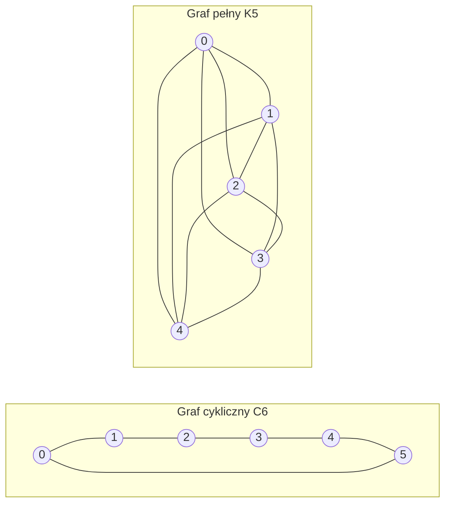

---
navigation:
  order: 20
---

# 2. Przygotowanie

## 2.1 Odwracalność i widmo

**Definicja 2.1 (Odwracalność).** Macierz przejścia \(P\) jest odwracalna względem rozkładu \(\pi\), jeżeli dla wszystkich \(x, y\) zachodzi \(\pi(x) P(x,y) = \pi(y) P(y,x)\).

Błądzenie losowe na grafie jest odwracalne, ponieważ \(\pi(x) P(x,y) = \frac{1}{4|E|}\) (gdy istnieje krawędź). Odwracalna macierz \(P\) jest samosprzężona względem iloczynu skalarnego \(\langle f, g \rangle_\pi = \sum_x f(x) g(x) \pi(x)\) i ma rzeczywiste wartości własne

$$
1 = \lambda_1 > \lambda_2 \ge \cdots \ge \lambda_n \ge -1
$$

W błądzeniu leniwym \(P = \frac12 (I + Q)\) (gdzie \(Q\) to błądzenie proste), więc wszystkie wartości własne są nie mniejsze niż \(0\).

**Definicja 2.2 (Przerwa spektralna).** Wielkość \(\gamma = 1 - \lambda_2\) nazywamy przerwą spektralną, a \(t_{\mathrm{rel}} = 1/\gamma\) — czasem relaksacji.

## 2.2 Lemat

**Lemat 2.3.** Dla odwracalnej macierzy \(P\) i dowolnego \(x\) zachodzi

$$
\bigl\| P^t(x,\cdot) - \pi \bigr\|_{\mathrm{TV}} \le \frac{1}{2} \sqrt{\frac{1 - \pi(x)}{\pi(x)}}\; \lambda_\ast^{\,t}, \qquad \lambda_\ast = \max_{i \ge 2} |\lambda_i|.
$$

*Dowód.* Z nierówności Cauchy'ego–Schwarza szacujemy odległość w wahaniu całkowitym przez normę \(\ell^2(\pi)\), a następnie oceniamy rozwinięcie spektralne \(P^t\) po usunięciu składnika z \(\lambda_1 = 1\). Szczegóły zob. [1, Twierdzenie 12.3]. \(\square\)

## 2.3 Grafy użyte w przykładach

**Rysunek 1.** Graf cykliczny \(C_6\) (po lewej) i graf pełny \(K_5\) (po prawej). Graf cykliczny ma dużą średnicę i miesza się wolno. Graf pełny zbliża się do rozkładu jednostajnego już po jednym kroku.
