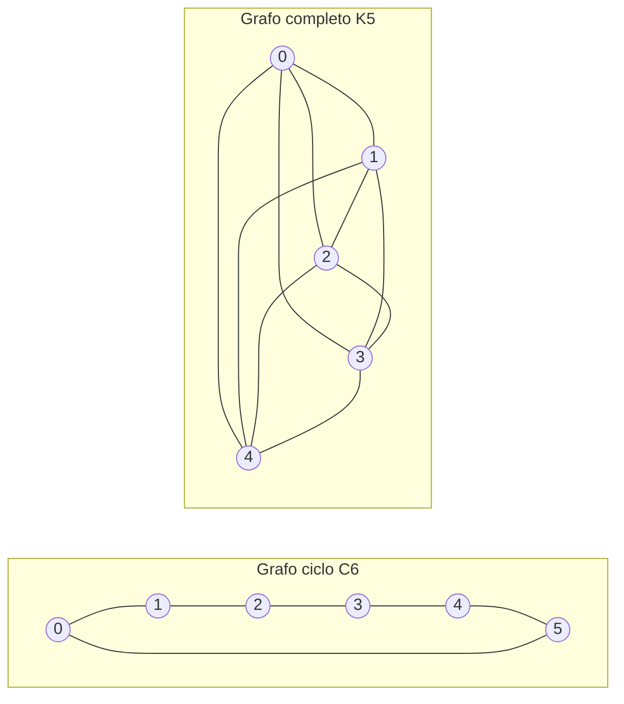

---
navigation:
  order: 20
---

# 2. Preliminares

## 2.1 Reversibilidade e espectro

**Definição 2.1 (Reversibilidade).** Uma matriz de transição \(P\) é reversível em relação a uma distribuição \(\pi\) quando \(\pi(x) P(x,y) = \pi(y) P(y,x)\) vale para todos os \(x, y\).

O passeio aleatório em um grafo é reversível, pois \(\pi(x) P(x,y) = \frac{1}{4|E|}\) quando há uma aresta. Um \(P\) reversível é autoadjunto em relação ao produto interno \(\langle f, g \rangle_\pi = \sum_x f(x) g(x) \pi(x)\) e tem autovalores reais

$$
1 = \lambda_1 > \lambda_2 \ge \cdots \ge \lambda_n \ge -1
$$

No passeio preguiçoso, \(P = \frac12 (I + Q)\) (sendo \(Q\) o passeio simples), de modo que todos os autovalores são maiores ou iguais a \(0\).

**Definição 2.2 (Lacuna espectral).** \(\gamma = 1 - \lambda_2\) é a lacuna espectral e \(t_{\mathrm{rel}} = 1/\gamma\) é o tempo de relaxação.

## 2.2 Lema

**Lema 2.3.** Para um \(P\) reversível e qualquer \(x\),

$$
\bigl\| P^t(x,\cdot) - \pi \bigr\|_{\mathrm{TV}} \le \frac{1}{2} \sqrt{\frac{1 - \pi(x)}{\pi(x)}}\; \lambda_\ast^{\,t}, \qquad \lambda_\ast = \max_{i \ge 2} |\lambda_i|.
$$

*Demonstração.* Por Cauchy–Schwarz, limita-se a distância de variação total pela norma \(\ell^2(\pi)\) e avalia-se a expansão em autovalores de \(P^t\) depois de remover o termo \(\lambda_1 = 1\). Para os detalhes, consulte [1, Teorema 12.3]. \(\square\)

## 2.3 Grafos usados nos exemplos

**Figura 1.** O grafo ciclo \(C_6\) (à esquerda) e o grafo completo \(K_5\) (à direita). O grafo ciclo tem diâmetro grande e mistura lentamente. O grafo completo se aproxima da distribuição uniforme em um único passo.
