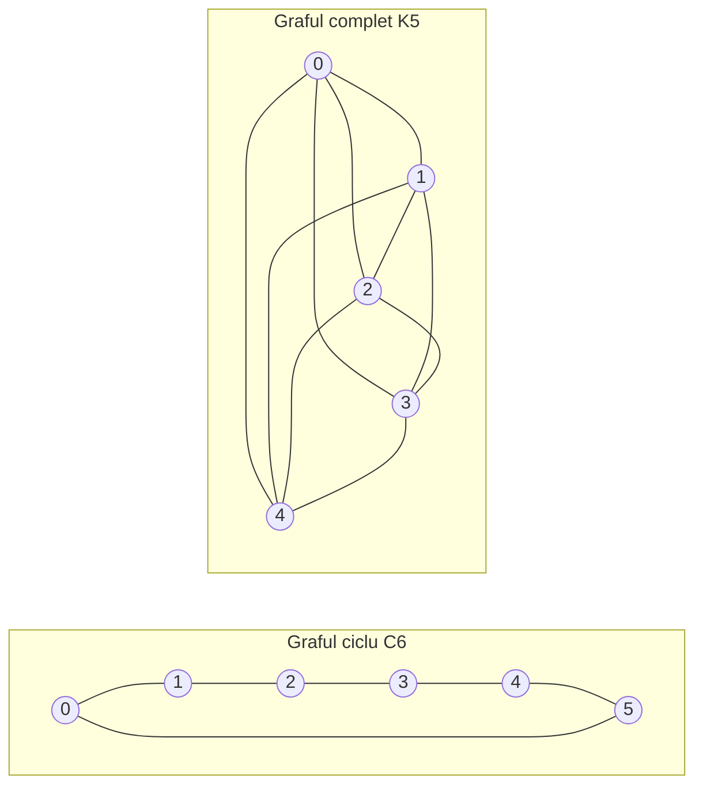

---
navigation:
  order: 20
---

# 2. Preliminarii

## 2.1 Reversibilitate și spectru

**Definiția 2.1 (Reversibilitate).** O matrice de tranziție \(P\) este reversibilă în raport cu o distribuție \(\pi\) dacă \(\pi(x) P(x,y) = \pi(y) P(y,x)\) are loc pentru toți \(x, y\).

Mersul aleator pe un graf este reversibil, deoarece \(\pi(x) P(x,y) = \frac{1}{4|E|}\) atunci când există o muchie. O matrice \(P\) reversibilă este autoadjunctă în raport cu produsul scalar \(\langle f, g \rangle_\pi = \sum_x f(x) g(x) \pi(x)\) și are valori proprii reale

$$
1 = \lambda_1 > \lambda_2 \ge \cdots \ge \lambda_n \ge -1
$$

Pentru mersul leneș, \(P = \frac12 (I + Q)\) (unde \(Q\) este mersul simplu), deci toate valorile proprii sunt cel puțin \(0\).

**Definiția 2.2 (Interval spectral).** \(\gamma = 1 - \lambda_2\) se numește interval spectral, iar \(t_{\mathrm{rel}} = 1/\gamma\) timp de relaxare.

## 2.2 O lemă

**Lema 2.3.** Pentru o matrice \(P\) reversibilă și pentru orice \(x\),

$$
\bigl\| P^t(x,\cdot) - \pi \bigr\|_{\mathrm{TV}} \le \frac{1}{2} \sqrt{\frac{1 - \pi(x)}{\pi(x)}}\; \lambda_\ast^{\,t}, \qquad \lambda_\ast = \max_{i \ge 2} |\lambda_i|.
$$

*Demonstrație.* Prin Cauchy–Schwarz, distanța în variație totală se majorează cu norma \(\ell^2(\pi)\), iar dezvoltarea după valorile proprii a lui \(P^t\) se evaluează după eliminarea termenului \(\lambda_1 = 1\). Pentru detalii, vezi [1, Teorema 12.3]. \(\square\)

## 2.3 Grafurile folosite în exemple

**Figura 1.** Graful ciclu \(C_6\) (stânga) și graful complet \(K_5\) (dreapta). Graful ciclu are diametru mare și se amestecă lent. Graful complet se apropie de distribuția uniformă într-un singur pas.
