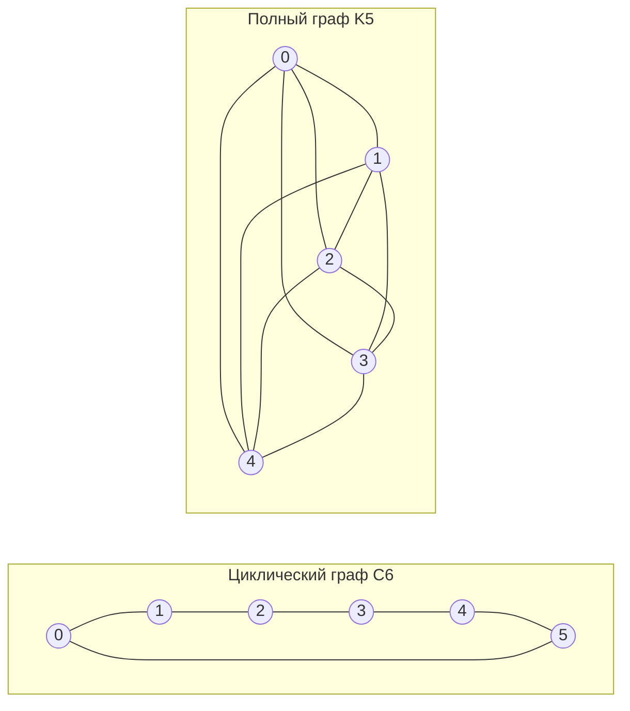

---
navigation:
  order: 20
---

# 2. Подготовка

## 2.1 Обратимость и спектр

**Определение 2.1 (обратимость).** Матрица переходов \(P\) обратима относительно распределения \(\pi\), если для всех \(x, y\) выполняется \(\pi(x) P(x,y) = \pi(y) P(y,x)\).

Случайное блуждание на графе обратимо, так как \(\pi(x) P(x,y) = \frac{1}{4|E|}\) (когда есть ребро). Обратимая \(P\) самосопряжена относительно скалярного произведения \(\langle f, g \rangle_\pi = \sum_x f(x) g(x) \pi(x)\) и имеет вещественные собственные значения

$$
1 = \lambda_1 > \lambda_2 \ge \cdots \ge \lambda_n \ge -1
$$

Для ленивого блуждания \(P = \frac12 (I + Q)\) (где \(Q\) — простое блуждание), поэтому все собственные значения не меньше \(0\).

**Определение 2.2 (спектральная щель).** Величину \(\gamma = 1 - \lambda_2\) называют спектральной щелью, а \(t_{\mathrm{rel}} = 1/\gamma\) — временем релаксации.

## 2.2 Лемма

**Лемма 2.3.** Для обратимой \(P\) и любого \(x\)

$$
\bigl\| P^t(x,\cdot) - \pi \bigr\|_{\mathrm{TV}} \le \frac{1}{2} \sqrt{\frac{1 - \pi(x)}{\pi(x)}}\; \lambda_\ast^{\,t}, \qquad \lambda_\ast = \max_{i \ge 2} |\lambda_i|.
$$

*Доказательство.* По неравенству Коши—Буняковского расстояние по вариации оценивается нормой \(\ell^2(\pi)\), после чего в собственном разложении \(P^t\) оценивается остаток, из которого исключён член с \(\lambda_1 = 1\). Подробности см. в [1, теорема 12.3]. \(\square\)

## 2.3 Графы, используемые в примерах

**Рис. 1.** Циклический граф \(C_6\) (слева) и полный граф \(K_5\) (справа). У циклического графа большой диаметр, и он перемешивается медленно. Полный граф приближается к равномерному распределению за один шаг.
