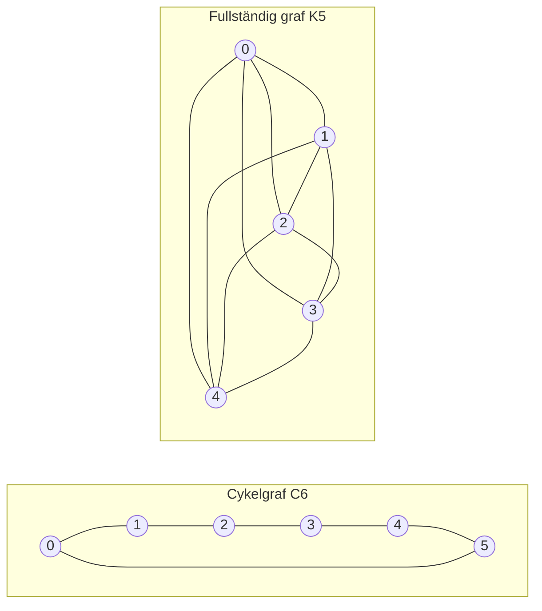

---
navigation:
  order: 20
---

# 2. Förberedelser

## 2.1 Reversibilitet och spektrum

**Definition 2.1 (Reversibilitet).** En övergångsmatris \(P\) sägs vara reversibel med avseende på en fördelning \(\pi\) om \(\pi(x) P(x,y) = \pi(y) P(y,x)\) gäller för alla \(x, y\).

Slumpvandringen på en graf är reversibel, eftersom \(\pi(x) P(x,y) = \frac{1}{4|E|}\) (när det finns en kant). Ett reversibelt \(P\) är självadjungerat med avseende på skalärprodukten \(\langle f, g \rangle_\pi = \sum_x f(x) g(x) \pi(x)\) och har de reella egenvärdena

$$
1 = \lambda_1 > \lambda_2 \ge \cdots \ge \lambda_n \ge -1
$$

För den lata vandringen är \(P = \frac12 (I + Q)\) (där \(Q\) är den enkla vandringen), så alla egenvärden är minst \(0\).

**Definition 2.2 (Spektralgap).** \(\gamma = 1 - \lambda_2\) kallas spektralgapet och \(t_{\mathrm{rel}} = 1/\gamma\) relaxationstiden.

## 2.2 Ett lemma

**Lemma 2.3.** För ett reversibelt \(P\) och godtyckligt \(x\) gäller

$$
\bigl\| P^t(x,\cdot) - \pi \bigr\|_{\mathrm{TV}} \le \frac{1}{2} \sqrt{\frac{1 - \pi(x)}{\pi(x)}}\; \lambda_\ast^{\,t}, \qquad \lambda_\ast = \max_{i \ge 2} |\lambda_i|.
$$

*Bevis.* Cauchy–Schwarz begränsar totalvariationsavståndet med \(\ell^2(\pi)\)-normen, och egenutvecklingen av \(P^t\) utvärderas sedan termen med \(\lambda_1 = 1\) avlägsnats. Se [1, Sats 12.3] för detaljerna. \(\square\)

## 2.3 Graferna som används i exemplen

**Figur 1.** Cykelgrafen \(C_6\) (till vänster) och den fullständiga grafen \(K_5\) (till höger). Cykelgrafen har stor diameter och blandar långsamt. Den fullständiga grafen närmar sig likformighet på ett enda steg.
