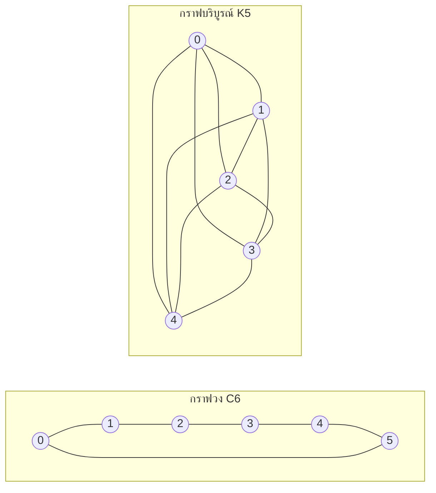

---
navigation:
  order: 20
---

# 2. การเตรียมความพร้อม

## 2.1 การย้อนกลับได้และสเปกตรัม

**นิยาม 2.1 (การย้อนกลับได้).** เมทริกซ์การเปลี่ยนสถานะ \(P\) เรียกว่าย้อนกลับได้เทียบกับการแจกแจง \(\pi\) เมื่อ \(\pi(x) P(x,y) = \pi(y) P(y,x)\) เป็นจริงสำหรับทุก \(x, y\)

การเดินสุ่มบนกราฟย้อนกลับได้ เนื่องจาก \(\pi(x) P(x,y) = \frac{1}{4|E|}\) (เมื่อมีเส้นเชื่อม) เมทริกซ์ \(P\) ที่ย้อนกลับได้เป็นตัวดำเนินการประกบตัวเองเทียบกับผลคูณภายใน \(\langle f, g \rangle_\pi = \sum_x f(x) g(x) \pi(x)\) และมีค่าลักษณะเฉพาะจำนวนจริง

$$
1 = \lambda_1 > \lambda_2 \ge \cdots \ge \lambda_n \ge -1
$$

สำหรับการเดินแบบเฉื่อย \(P = \frac12 (I + Q)\) (โดย \(Q\) คือการเดินอย่างง่าย) ดังนั้นค่าลักษณะเฉพาะทุกค่าจึงมีค่าตั้งแต่ \(0\) ขึ้นไป

**นิยาม 2.2 (ช่องว่างสเปกตรัม).** เรียก \(\gamma = 1 - \lambda_2\) ว่าช่องว่างสเปกตรัม และเรียก \(t_{\mathrm{rel}} = 1/\gamma\) ว่าเวลาผ่อนคลาย

## 2.2 บทตั้ง

**บทตั้ง 2.3.** สำหรับ \(P\) ที่ย้อนกลับได้และ \(x\) ใด ๆ

$$
\bigl\| P^t(x,\cdot) - \pi \bigr\|_{\mathrm{TV}} \le \frac{1}{2} \sqrt{\frac{1 - \pi(x)}{\pi(x)}}\; \lambda_\ast^{\,t}, \qquad \lambda_\ast = \max_{i \ge 2} |\lambda_i|.
$$

*บทพิสูจน์.* ใช้ Cauchy–Schwarz ควบคุมระยะทางการแปรผันรวมด้วยนอร์ม \(\ell^2(\pi)\) แล้วประเมินส่วนที่เหลือจากการกระจายค่าลักษณะเฉพาะของ \(P^t\) หลังตัดพจน์ \(\lambda_1 = 1\) ออก รายละเอียดดูที่ [1, ทฤษฎีบท 12.3] \(\square\)

## 2.3 กราฟที่ใช้ในตัวอย่าง

**แผนภาพ 1.** กราฟวง \(C_6\) (ซ้าย) และกราฟบริบูรณ์ \(K_5\) (ขวา) กราฟวงมีเส้นผ่านศูนย์กลางใหญ่จึงผสมช้า ส่วนกราฟบริบูรณ์เข้าใกล้การแจกแจงเอกรูปได้ภายในก้าวเดียว
