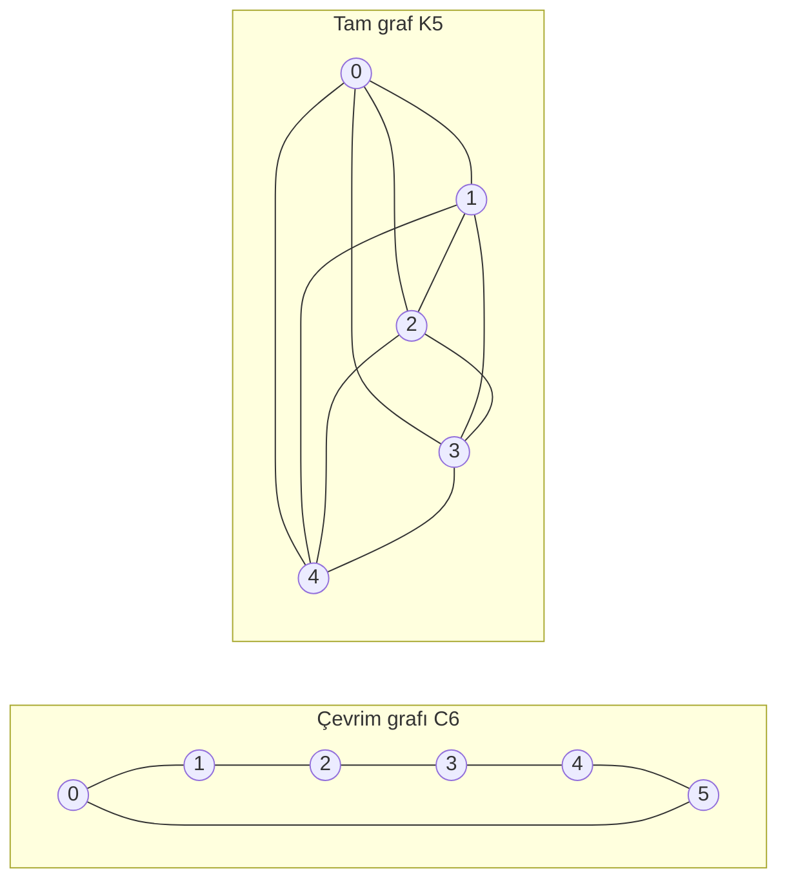

---
navigation:
  order: 20
---

# 2. Hazırlıklar

## 2.1 Tersinirlik ve spektrum

**Tanım 2.1 (Tersinirlik).** Bir \(P\) geçiş matrisinin bir \(\pi\) dağılımına göre tersinir olması, tüm \(x, y\) için \(\pi(x) P(x,y) = \pi(y) P(y,x)\) eşitliğinin sağlanması demektir.

Bir graf üzerindeki rastgele yürüyüş, \(x\) ile \(y\) arasında kenar bulunduğunda \(\pi(x) P(x,y) = \frac{1}{4|E|}\) olduğundan tersinirdir. Tersinir bir \(P\), \(\langle f, g \rangle_\pi = \sum_x f(x) g(x) \pi(x)\) iç çarpımına göre öz-eşleniktir ve

$$
1 = \lambda_1 > \lambda_2 \ge \cdots \ge \lambda_n \ge -1
$$

gerçel özdeğerlerine sahiptir. Tembel yürüyüşte \(P = \frac12 (I + Q)\) olduğundan (\(Q\) basit yürüyüştür), tüm özdeğerler \(0\) veya daha büyüktür.

**Tanım 2.2 (Spektral aralık).** \(\gamma = 1 - \lambda_2\) değerine spektral aralık, \(t_{\mathrm{rel}} = 1/\gamma\) değerine gevşeme süresi denir.

## 2.2 Yardımcı teorem

**Yardımcı Teorem 2.3.** Tersinir bir \(P\) ve herhangi bir \(x\) için

$$
\bigl\| P^t(x,\cdot) - \pi \bigr\|_{\mathrm{TV}} \le \frac{1}{2} \sqrt{\frac{1 - \pi(x)}{\pi(x)}}\; \lambda_\ast^{\,t}, \qquad \lambda_\ast = \max_{i \ge 2} |\lambda_i|.
$$

*Kanıt.* Cauchy–Schwarz ile toplam değişim uzaklığı \(\ell^2(\pi)\) normuyla sınırlanır ve \(P^t\) öz açılımında \(\lambda_1 = 1\) terimi çıkarıldıktan sonra kalan kısım değerlendirilir. Ayrıntılar için bkz. [1, Teorem 12.3]. \(\square\)

## 2.3 Örneklerde kullanılan graflar

**Şekil 1.** Çevrim grafı \(C_6\) (solda) ve tam graf \(K_5\) (sağda). Çevrim grafının çapı büyüktür ve karışması yavaştır. Tam graf ise tek adımda düzgün dağılıma yaklaşır.
