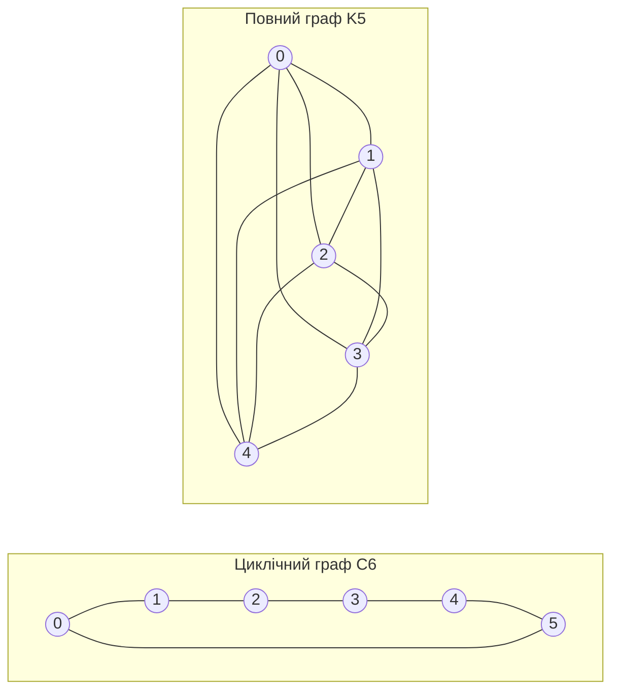

---
navigation:
  order: 20
---

# 2. Підготовка

## 2.1 Оборотність і спектр

**Означення 2.1 (Оборотність).** Матриця переходів \(P\) є оборотною відносно розподілу \(\pi\), якщо для всіх \(x, y\) виконується \(\pi(x) P(x,y) = \pi(y) P(y,x)\).

Випадкове блукання на графі є оборотним, оскільки \(\pi(x) P(x,y) = \frac{1}{4|E|}\) (коли є ребро). Оборотна \(P\) є самоспряженою відносно скалярного добутку \(\langle f, g \rangle_\pi = \sum_x f(x) g(x) \pi(x)\) і має дійсні власні значення

$$
1 = \lambda_1 > \lambda_2 \ge \cdots \ge \lambda_n \ge -1
$$

Для лінивого блукання \(P = \frac12 (I + Q)\) (де \(Q\) — просте блукання), тому всі власні значення не менші за \(0\).

**Означення 2.2 (Спектральна щілина).** Величину \(\gamma = 1 - \lambda_2\) називають спектральною щілиною, а \(t_{\mathrm{rel}} = 1/\gamma\) — часом релаксації.

## 2.2 Лема

**Лема 2.3.** Для оборотної \(P\) і довільного \(x\)

$$
\bigl\| P^t(x,\cdot) - \pi \bigr\|_{\mathrm{TV}} \le \frac{1}{2} \sqrt{\frac{1 - \pi(x)}{\pi(x)}}\; \lambda_\ast^{\,t}, \qquad \lambda_\ast = \max_{i \ge 2} |\lambda_i|.
$$

*Доведення.* За нерівністю Коші — Шварца відстань за повною варіацією оцінюється нормою \(\ell^2(\pi)\), а розклад \(P^t\) за власними значеннями оцінюється після вилучення члена з \(\lambda_1 = 1\). Подробиці див. у [1, теорема 12.3]. \(\square\)

## 2.3 Графи, які використано в прикладах

**Рисунок 1.** Циклічний граф \(C_6\) (ліворуч) і повний граф \(K_5\) (праворуч). Циклічний граф має великий діаметр і змішується повільно. Повний граф наближається до рівномірного розподілу за один крок.
