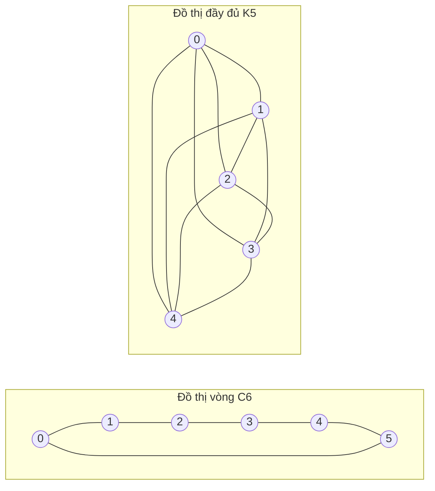

---
navigation:
  order: 20
---

# 2. Chuẩn bị

## 2.1 Tính khả nghịch và phổ

**Định nghĩa 2.1 (Tính khả nghịch).** Ma trận chuyển \(P\) được gọi là khả nghịch đối với phân phối \(\pi\) nếu \(\pi(x) P(x,y) = \pi(y) P(y,x)\) đúng với mọi \(x, y\).

Bước đi ngẫu nhiên trên đồ thị là khả nghịch, vì \(\pi(x) P(x,y) = \frac{1}{4|E|}\) khi có cạnh nối. Ma trận \(P\) khả nghịch là tự liên hợp đối với tích trong \(\langle f, g \rangle_\pi = \sum_x f(x) g(x) \pi(x)\), và có các giá trị riêng thực

$$
1 = \lambda_1 > \lambda_2 \ge \cdots \ge \lambda_n \ge -1
$$

Với bước đi trì hoãn, \(P = \frac12 (I + Q)\) (trong đó \(Q\) là bước đi đơn giản), nên mọi giá trị riêng đều lớn hơn hoặc bằng \(0\).

**Định nghĩa 2.2 (Khoảng trống phổ).** \(\gamma = 1 - \lambda_2\) được gọi là khoảng trống phổ, còn \(t_{\mathrm{rel}} = 1/\gamma\) là thời gian hồi phục.

## 2.2 Bổ đề

**Bổ đề 2.3.** Với \(P\) khả nghịch và \(x\) bất kỳ,

$$
\bigl\| P^t(x,\cdot) - \pi \bigr\|_{\mathrm{TV}} \le \frac{1}{2} \sqrt{\frac{1 - \pi(x)}{\pi(x)}}\; \lambda_\ast^{\,t}, \qquad \lambda_\ast = \max_{i \ge 2} |\lambda_i|.
$$

*Chứng minh.* Dùng bất đẳng thức Cauchy–Schwarz để chặn khoảng cách biến phân toàn phần bằng chuẩn \(\ell^2(\pi)\), rồi đánh giá phần còn lại của khai triển riêng của \(P^t\) sau khi loại bỏ số hạng \(\lambda_1 = 1\). Xem chi tiết tại [1, Định lý 12.3]. \(\square\)

## 2.3 Các đồ thị dùng trong ví dụ

**Hình 1.** Đồ thị vòng \(C_6\) (trái) và đồ thị đầy đủ \(K_5\) (phải). Đồ thị vòng có đường kính lớn nên trộn chậm. Đồ thị đầy đủ tiến gần đến phân phối đều chỉ sau một bước.
