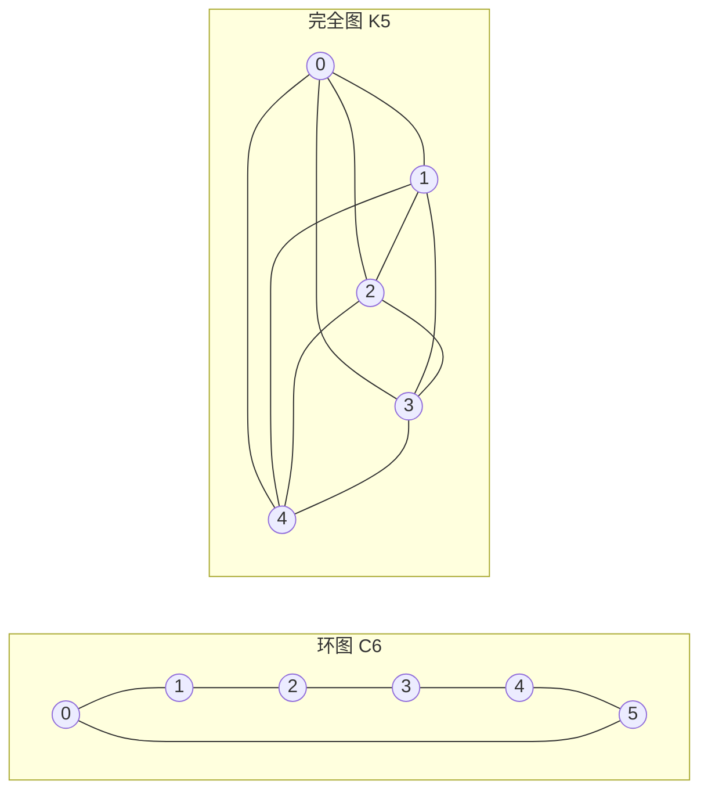

---
navigation:
  order: 20
---

# 2. 预备知识

## 2.1 可逆性与谱

**定义 2.1（可逆性）.** 设转移矩阵 \(P\) 与分布 \(\pi\) 满足：对所有 \(x, y\) 都有 \(\pi(x) P(x,y) = \pi(y) P(y,x)\)，则称 \(P\) 关于 \(\pi\) 可逆。

图上的随机游走是可逆的，因为当 \(x\) 与 \(y\) 之间有边时 \(\pi(x) P(x,y) = \frac{1}{4|E|}\)。可逆的 \(P\) 关于内积 \(\langle f, g \rangle_\pi = \sum_x f(x) g(x) \pi(x)\) 是自伴的，并具有实特征值

$$
1 = \lambda_1 > \lambda_2 \ge \cdots \ge \lambda_n \ge -1
$$

对于惰性游走，\(P = \frac12 (I + Q)\)（其中 \(Q\) 为简单游走），因此所有特征值都不小于 \(0\)。

**定义 2.2（谱隙）.** 称 \(\gamma = 1 - \lambda_2\) 为谱隙，称 \(t_{\mathrm{rel}} = 1/\gamma\) 为弛豫时间。

## 2.2 引理

**引理 2.3.** 对可逆的 \(P\) 和任意的 \(x\)，

$$
\bigl\| P^t(x,\cdot) - \pi \bigr\|_{\mathrm{TV}} \le \frac{1}{2} \sqrt{\frac{1 - \pi(x)}{\pi(x)}}\; \lambda_\ast^{\,t}, \qquad \lambda_\ast = \max_{i \ge 2} |\lambda_i|.
$$

*证明.* 由 Cauchy–Schwarz 不等式用 \(\ell^2(\pi)\) 范数控制全变差距离，再在 \(P^t\) 的特征展开中去掉 \(\lambda_1 = 1\) 的项后对其余部分作估计。详见 [1, 定理 12.3]。 \(\square\)

## 2.3 示例中使用的图

**图 1.** 环图 \(C_6\)（左）与完全图 \(K_5\)（右）。环图的直径较大，混合较慢；完全图只需一步就接近均匀分布。
