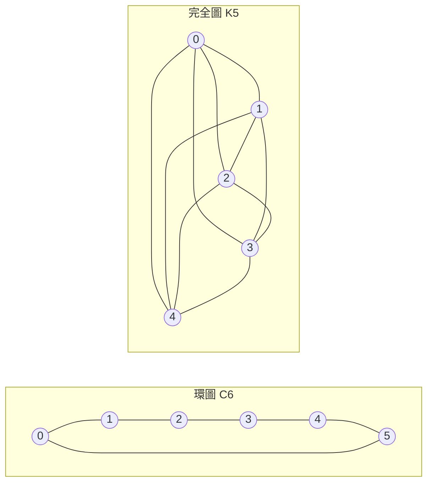

---
navigation:
  order: 20
---

# 2. 準備

## 2.1 可逆性與譜

**定義 2.1（可逆性）.** 若對所有 \(x, y\) 都成立 \(\pi(x) P(x,y) = \pi(y) P(y,x)\)，則稱轉移矩陣 \(P\) 相對於分布 \(\pi\) 為可逆。

圖上的隨機漫步是可逆的，因為當 \(x\) 與 \(y\) 之間有邊時 \(\pi(x) P(x,y) = \frac{1}{4|E|}\)。可逆的 \(P\) 相對於內積 \(\langle f, g \rangle_\pi = \sum_x f(x) g(x) \pi(x)\) 是自伴的，並具有實特徵值

$$
1 = \lambda_1 > \lambda_2 \ge \cdots \ge \lambda_n \ge -1
$$

對於懶惰漫步，\(P = \frac12 (I + Q)\)（\(Q\) 為簡單漫步），因此所有特徵值都在 \(0\) 以上。

**定義 2.2（譜隙）.** 稱 \(\gamma = 1 - \lambda_2\) 為譜隙，\(t_{\mathrm{rel}} = 1/\gamma\) 為鬆弛時間。

## 2.2 引理

**引理 2.3.** 對可逆的 \(P\) 與任意的 \(x\)，

$$
\bigl\| P^t(x,\cdot) - \pi \bigr\|_{\mathrm{TV}} \le \frac{1}{2} \sqrt{\frac{1 - \pi(x)}{\pi(x)}}\; \lambda_\ast^{\,t}, \qquad \lambda_\ast = \max_{i \ge 2} |\lambda_i|.
$$

*證明.* 由 Cauchy–Schwarz 以 \(\ell^2(\pi)\) 範數界定全變差距離，再以 \(P^t\) 的特徵展開去掉 \(\lambda_1 = 1\) 的項後評估其餘部分。細節請參閱 [1, 定理 12.3]。 \(\square\)

## 2.3 範例所用的圖

**圖 1.** 環圖 \(C_6\)（左）與完全圖 \(K_5\)（右）。環圖的直徑大，混合較慢；完全圖只需一步就接近均勻分布。
