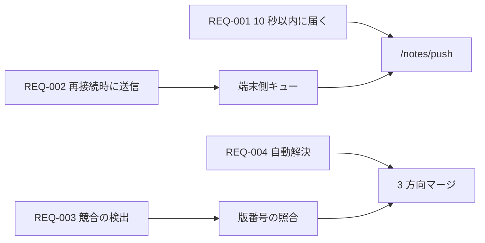

---
navigation:
  order: 30
---

# 2.3 要件の追跡

要件は [構成](../03-architecture/README.md) の各要素と [API](../04-api/README.md) の各エンドポイントに対応づける。対応のない要件は未実装として扱う。

```mermaid
flowchart LR
  REQ001[REQ-001 10 秒以内に届く] --> PUSH["/notes/push"]
  REQ002[REQ-002 再接続時に送信] --> QUEUE[端末側キュー]
  REQ003[REQ-003 競合の検出] --> VERSION[版番号の照合]
  REQ004[REQ-004 自動解決] --> MERGE[3 方向マージ]
  QUEUE --> PUSH
  VERSION --> MERGE
```
