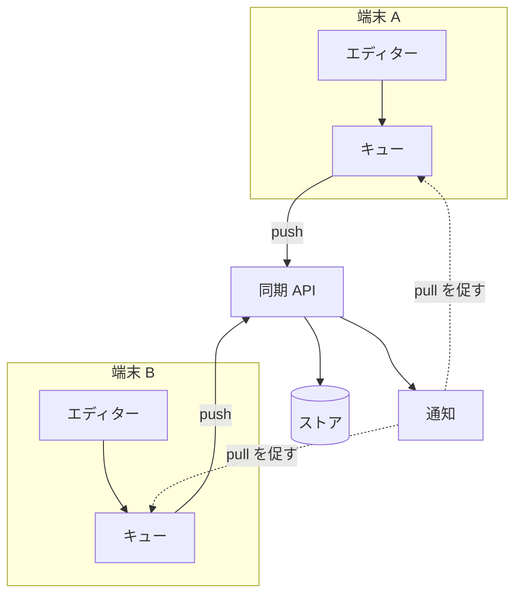
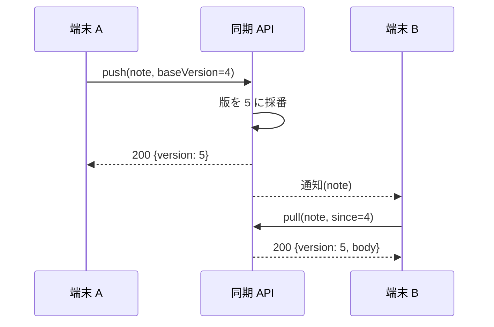

---
navigation:
  order: 30
---

# 3. 構成

## 3.1 構成要素

| 要素 | 役割 |
|---|---|
| クライアント | ノートの編集を監視し、変更をキューに入れ、接続時にサーバーへ送る |
| 同期 API | 変更の受け付け、版の採番、他端末への配信 |
| ストア | ノートの現在の内容と、直近 30 日の履歴 |
| 通知 | 変更があった端末へ、取得を促す軽量な合図を送る |

## 3.2 同期の流れ

## 3.3 版番号

版番号はノートごとにサーバーが採番する単調増加の整数である。端末は最後に受け取った版を `baseVersion` として送る。サーバーの現在の版と `baseVersion` が一致しないとき、競合とする（REQ-003）。

## 3.4 競合の解決

| 場合 | 規則 |
|---|---|
| 同じ行を別々に変更した | 両方の変更を残し、後から届いた方を `>>>` で区切って末尾に付ける。利用者に競合ありと表示する（REQ-006） |
| 異なる行を変更した | 3 方向マージで自動的に統合する。利用者には知らせない |
| 片方が削除した | 削除を優先し、もう片方の内容をごみ箱に入れる（REQ-005） |

いずれの場合も内容を失わない（REQ-004）。
