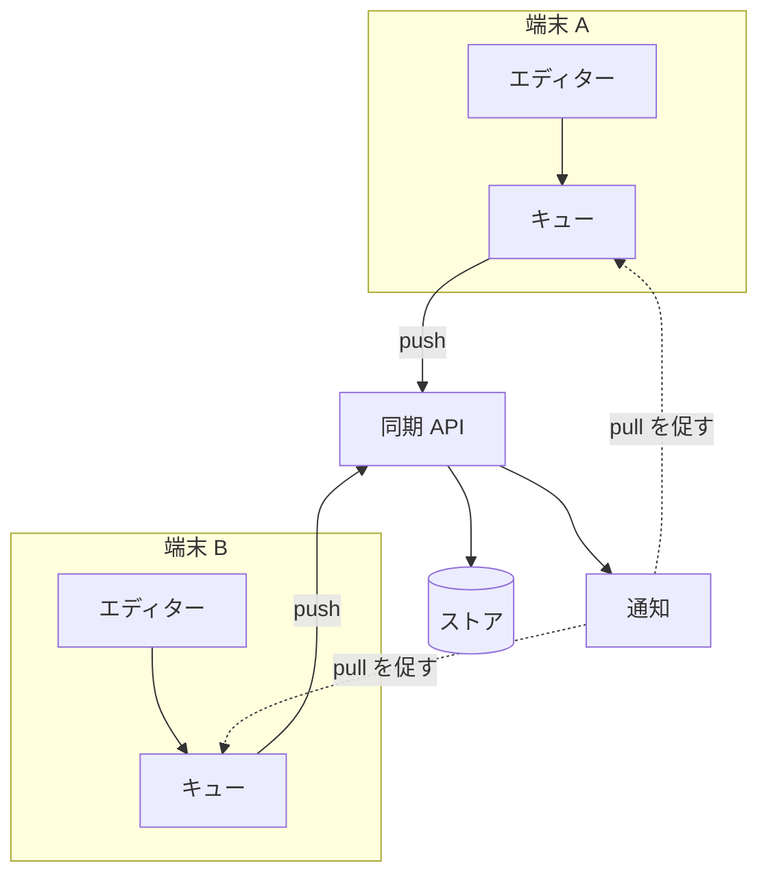

---
navigation:
  order: 10
---

# 3.1 構成要素

| 要素 | 役割 |
|---|---|
| クライアント | ノートの編集を監視し、変更をキューに入れ、接続時にサーバーへ送る |
| 同期 API | 変更の受け付け、版の採番、他端末への配信 |
| ストア | ノートの現在の内容と、直近 30 日の履歴 |
| 通知 | 変更があった端末へ、取得を促す軽量な合図を送る |

