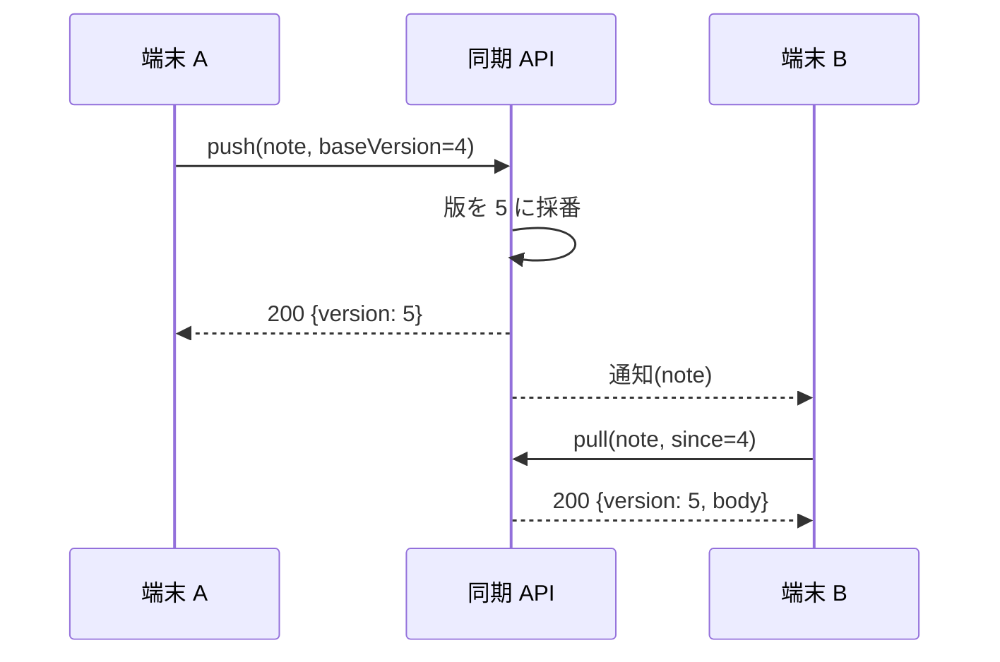

---
navigation:
  order: 20
---

# 3.2 同期の流れ

```mermaid
sequenceDiagram
  participant A as 端末 A
  participant S as 同期 API
  participant B as 端末 B
  A->>S: push(note, baseVersion=4)
  S->>S: 版を 5 に採番
  S-->>A: 200 {version: 5}
  S-->>B: 通知(note)
  B->>S: pull(note, since=4)
  S-->>B: 200 {version: 5, body}
```

端末 A の変更はサーバーで新しい版を得て、通知を受けた端末 B が取得する。通知は取得を促す合図であり、本文を運ばない。
