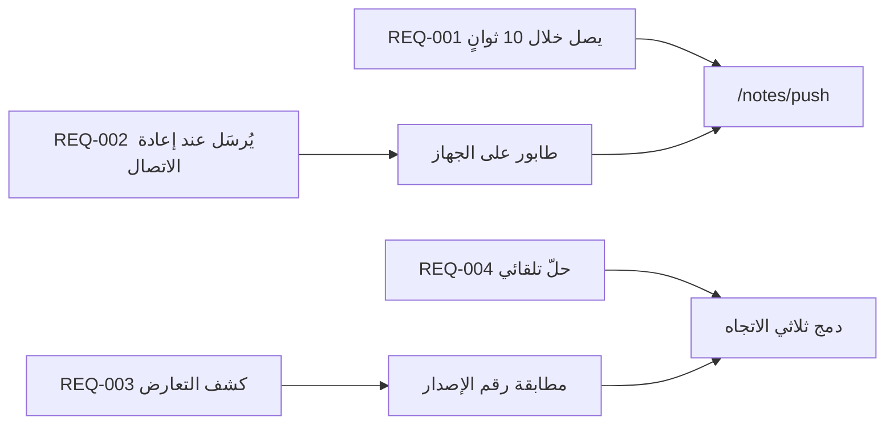

---
navigation:
  order: 30
---

# 2.3 تتبّع المتطلبات

تُربَط المتطلبات بعناصر [البنية](../03-architecture/README.md) وبنقاط نهاية [واجهة البرمجة](../04-api/README.md). ويُعدّ أي متطلب بلا ارتباط غير منفَّذ.

