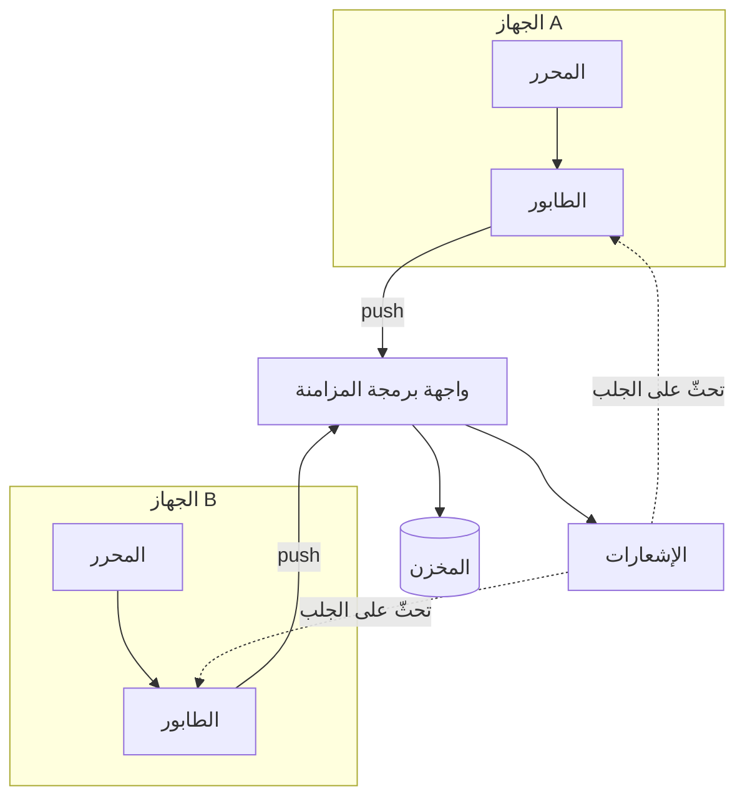

---
navigation:
  order: 10
---

# 3.1 المكوّنات

| العنصر | الدور |
|---|---|
| العميل | يراقب تعديلات الملاحظات، ويضع التغييرات في طابور، ويرسلها إلى الخادم عند الاتصال |
| واجهة برمجة المزامنة | تستقبل التغييرات، وترقّم الإصدارات، وتوزّعها على الأجهزة الأخرى |
| المخزن | المحتوى الحالي لكل ملاحظة، وسجلّ آخر 30 يومًا |
| الإشعارات | ترسل إشارة خفيفة إلى الجهاز الذي طرأ عليه تغيير لحثّه على الجلب |

