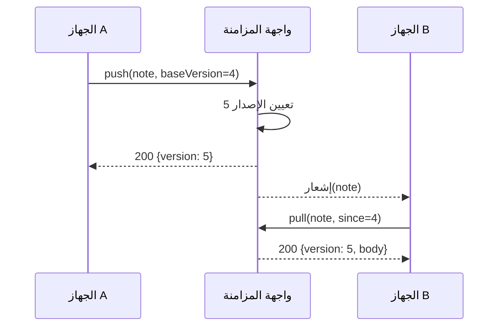

---
navigation:
  order: 20
---

# ٣٫٢ تدفق المزامنة

```mermaid
sequenceDiagram
  participant A as الجهاز A
  participant S as واجهة المزامنة
  participant B as الجهاز B
  A->>S: push(note, baseVersion=4)
  S->>S: تعيين الإصدار 5
  S-->>A: 200 {version: 5}
  S-->>B: إشعار(note)
  B->>S: pull(note, since=4)
  S-->>B: 200 {version: 5, body}
```

يحصل تغيير الجهاز A على إصدار جديد في الخادم، ثم يجلبه الجهاز B بعد تلقّي الإشعار. والإشعار إشارة تحثّ على الجلب، ولا يحمل النص.
