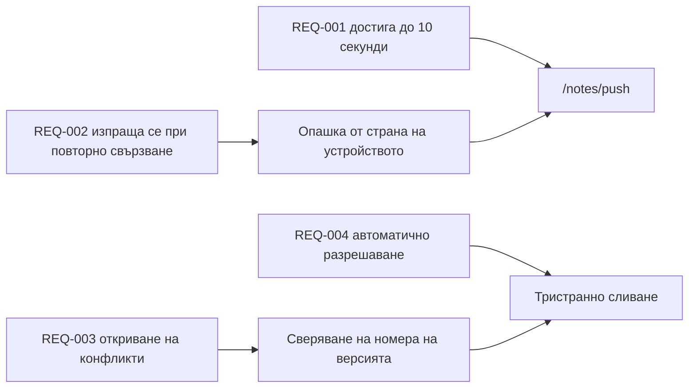

---
navigation:
  order: 30
---

# 2.3 Проследимост на изискванията

Изискванията се съотнасят към елементите на [архитектурата](../03-architecture/README.md) и към крайните точки на [API](../04-api/README.md). Изискване без съответствие се смята за нереализирано.

