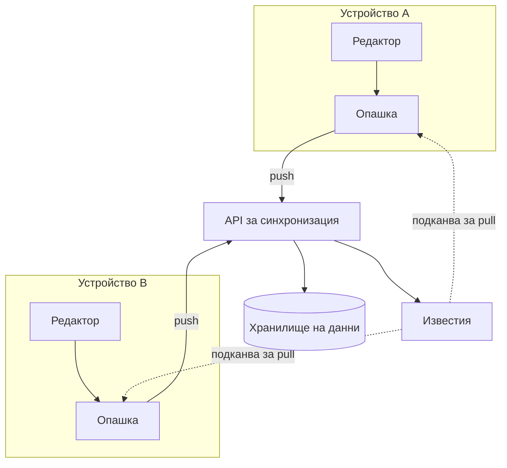

---
navigation:
  order: 10
---

# 3.1 Съставни части

| Елемент | Роля |
|---|---|
| Клиент | Следи редактирането на бележките, поставя промените в опашка и ги изпраща към сървъра при свързване |
| API за синхронизация | Приема промените, присвоява им номер на версия и ги разпространява към другите устройства |
| Хранилище на данни | Пази текущото съдържание на всяка бележка и историята ѝ от последните 30 дни |
| Известия | Изпраща лек сигнал към устройството, което трябва да изтегли промените, когато има промяна |

