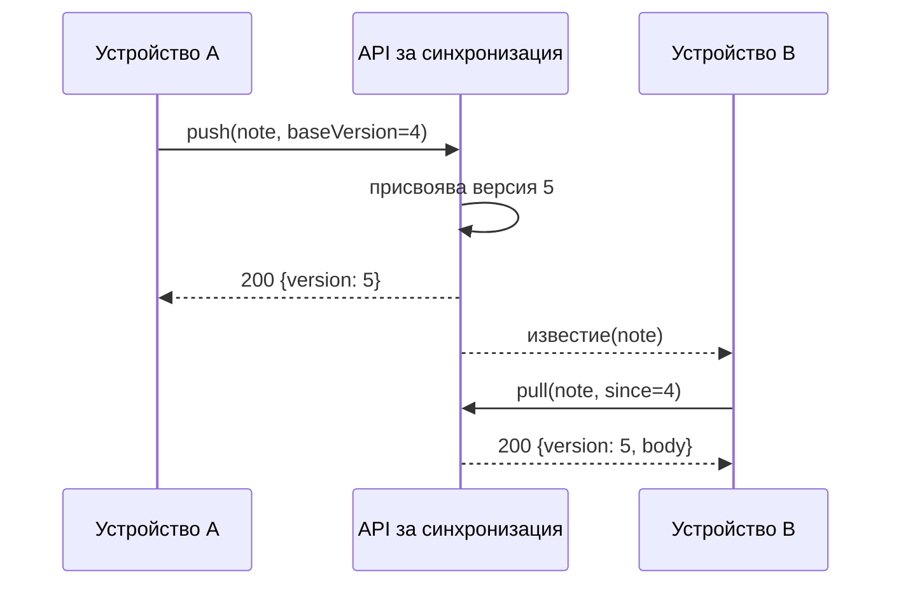

---
navigation:
  order: 20
---

# 3.2 Протичане на синхронизацията

Промяната на устройство A получава нова версия на сървъра, а устройство B я изтегля, след като бъде известено. Известието е подкана за изтегляне; то не носи съдържанието.
