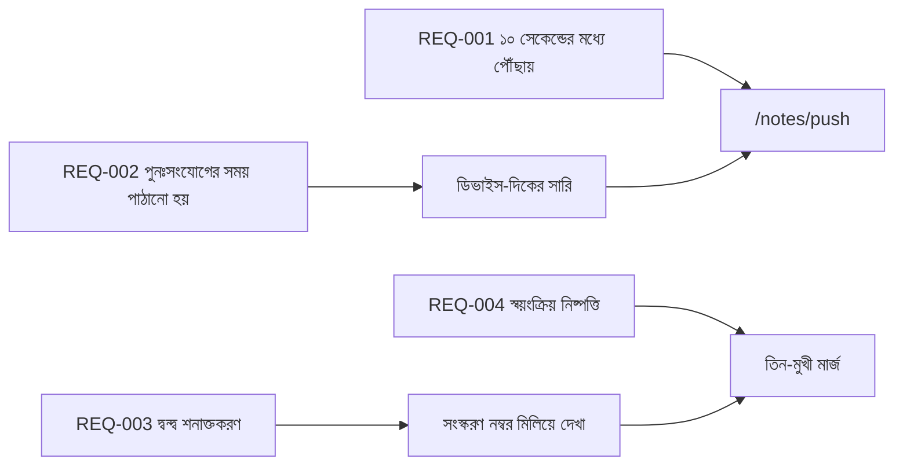

---
navigation:
  order: 30
---

# ২.৩ প্রয়োজনীয়তার ট্রেসেবিলিটি

প্রয়োজনীয়তাগুলিকে [স্থাপত্য](../03-architecture/README.md)-এর প্রতিটি উপাদান এবং [API](../04-api/README.md)-এর প্রতিটি এন্ডপয়েন্টের সঙ্গে মেলানো হয়। যে প্রয়োজনীয়তার সঙ্গে কিছুই মেলানো নেই, তা অবাস্তবায়িত হিসেবে গণ্য করা হয়।

