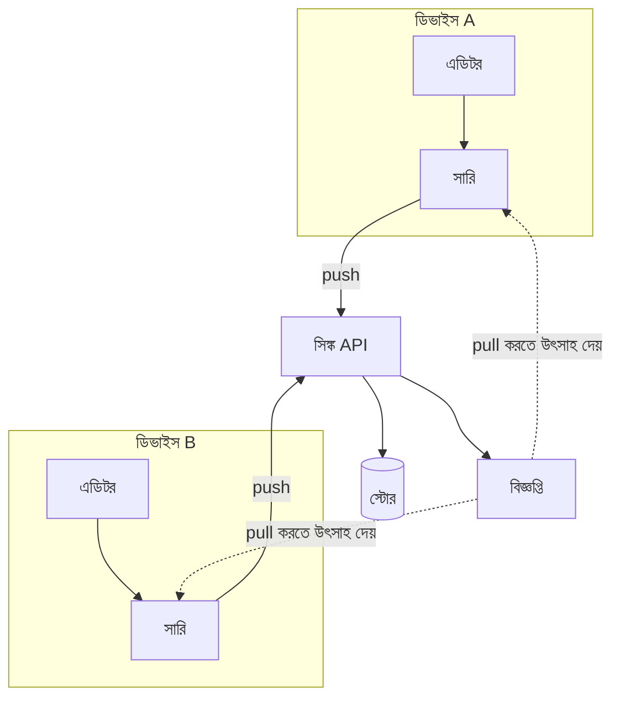

---
navigation:
  order: 10
---

# ৩.১ উপাদানসমূহ

| উপাদান | ভূমিকা |
|---|---|
| ক্লায়েন্ট | নোটের সম্পাদনা পর্যবেক্ষণ করে, পরিবর্তনগুলি সারিতে রাখে এবং সংযোগ হলে সার্ভারে পাঠায় |
| সিঙ্ক API | পরিবর্তন গ্রহণ করে, সংস্করণ নম্বর দেয় এবং অন্যান্য ডিভাইসে বিতরণ করে |
| স্টোর | নোটের বর্তমান বিষয়বস্তু এবং সাম্প্রতিক ৩০ দিনের ইতিহাস রাখে |
| বিজ্ঞপ্তি | পরিবর্তন হলে সংশ্লিষ্ট ডিভাইসে তা আনার জন্য একটি হালকা সংকেত পাঠায় |

