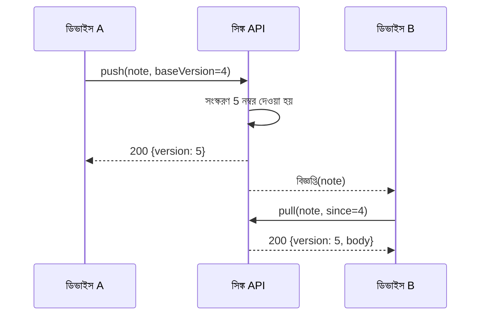

---
navigation:
  order: 20
---

# 3.2 সিঙ্ক্রোনাইজেশনের প্রবাহ

ডিভাইস A-এর পরিবর্তন সার্ভারে একটি নতুন সংস্করণ পায়, আর বিজ্ঞপ্তি পাওয়া ডিভাইস B সেটি নিয়ে আসে। বিজ্ঞপ্তি হলো নিয়ে আসার সংকেত মাত্র, এটি মূল লেখা বহন করে না।
