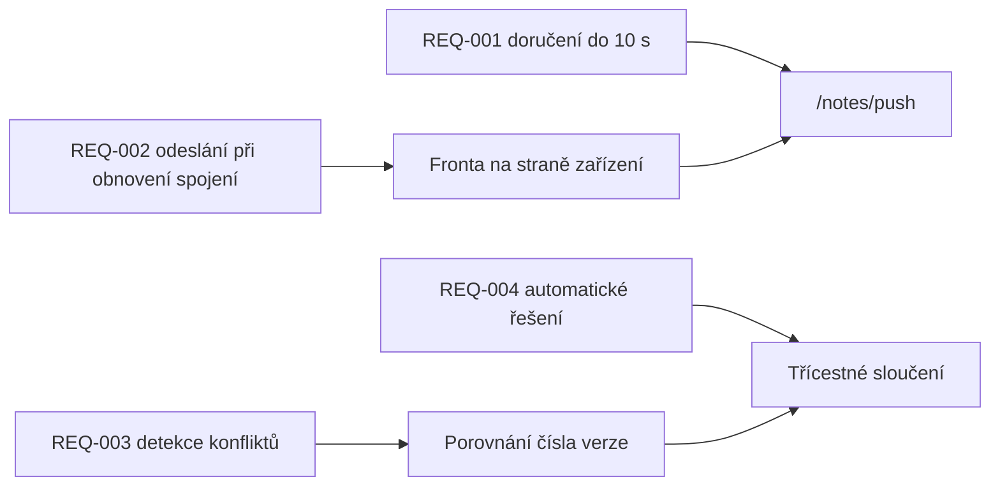

---
navigation:
  order: 30
---

# 2.3 Sledovatelnost požadavků

Požadavky se přiřazují k jednotlivým prvkům [architektury](../03-architecture/README.md) a k jednotlivým koncovým bodům [API](../04-api/README.md). Požadavek bez přiřazení se považuje za neimplementovaný.

