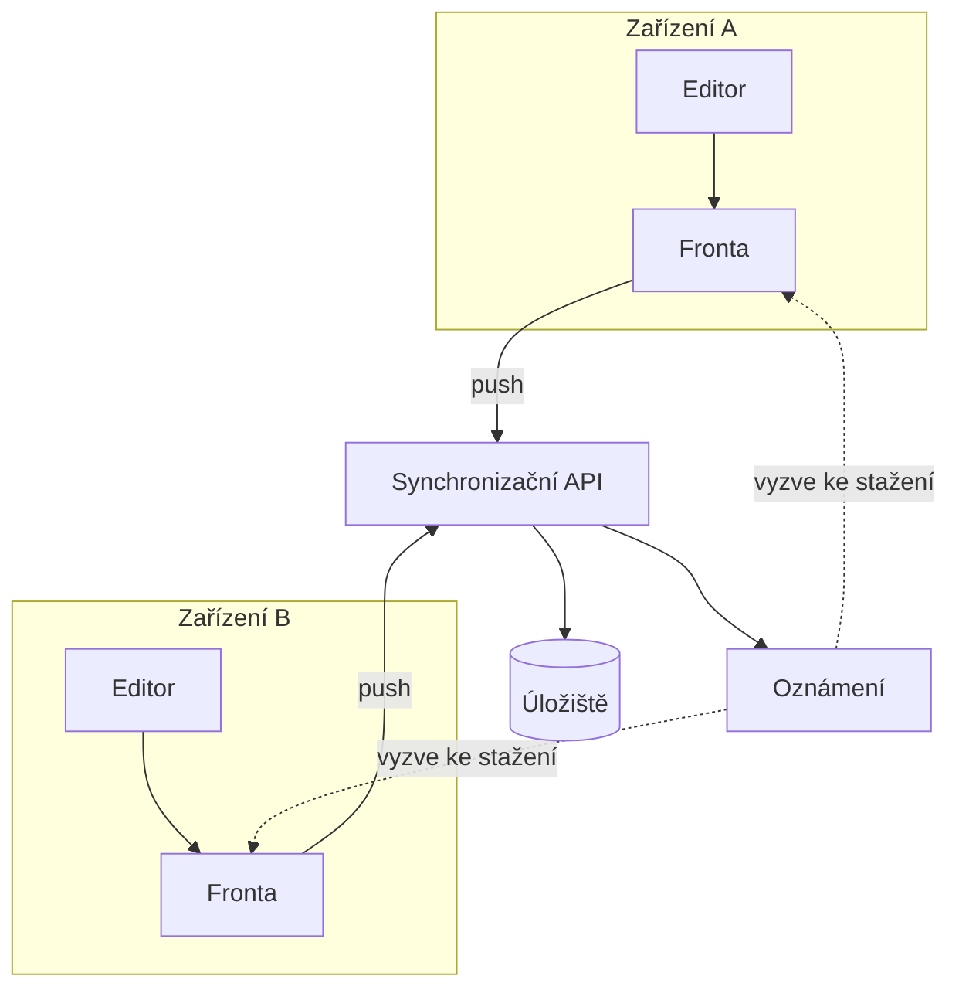

---
navigation:
  order: 10
---

# 3.1 Součásti

| Prvek | Role |
|---|---|
| Klient | Sleduje úpravy poznámek, řadí změny do fronty a při připojení je odesílá na server |
| Synchronizační API | Přijímá změny, přiděluje čísla verzí a rozesílá je na ostatní zařízení |
| Úložiště | Uchovává aktuální obsah každé poznámky a její historii za posledních 30 dní |
| Oznámení | Při vzniku změny odešle zařízení lehký signál, který vyzve ke stažení |

