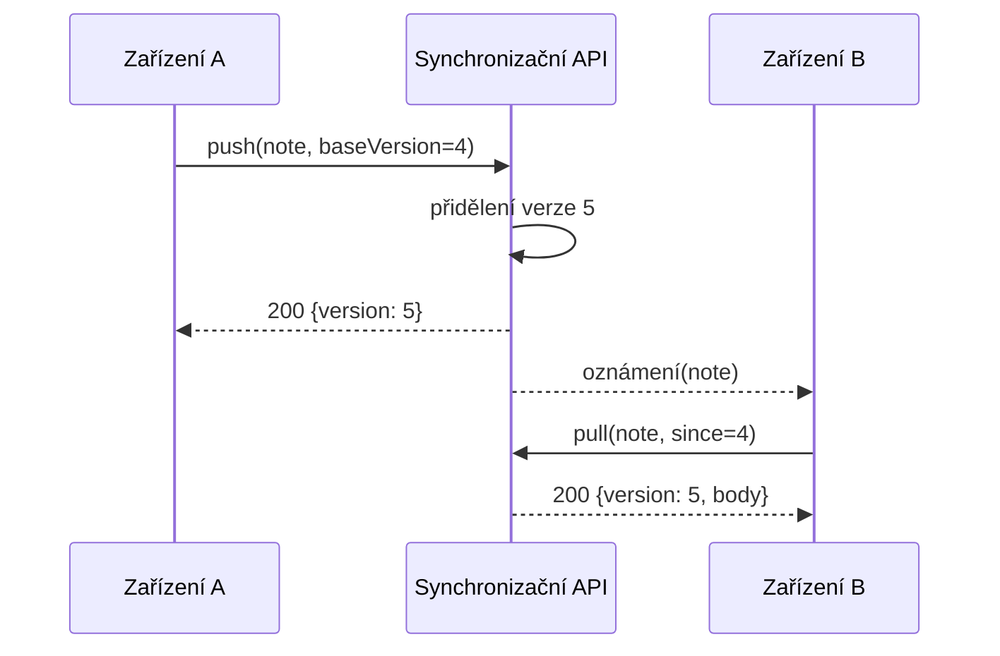

---
navigation:
  order: 20
---

# 3.2 Průběh synchronizace

Změna ze zařízení A dostane na serveru novou verzi a zařízení B si ji po oznámení stáhne. Oznámení je pouze pokynem ke stažení, samotný obsah nepřenáší.
